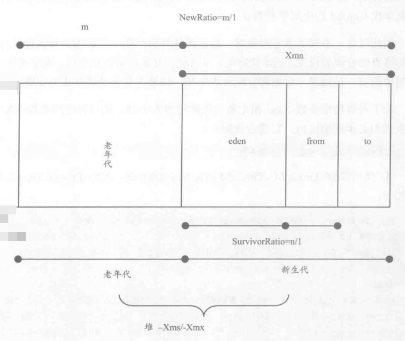

[TOC]


# JVM参数类型

- 标准参数（在jvm的各个版本基本不变）

  - -help
  - -version
  - -server
  - -client

- X参数（非标准化参数）

  - -Xint 解释执行
  - -Xcomp 第一次使用就编译成本地代码
  - -Xmixed 混合模式，虚拟机自己决定是否编译成本地代码

- XX参数（非标准，相对不稳定，主要用于jvm调优和Debug）

  - Boolean类型: -XX:[+-]<name> 表示启用或者禁用name属性
  - 非Boolean类型：-XX:<name>=<value> 表示name的属性值是value

  

  


# 运行时JVM参数查看

- jinfo

-  -XX:+PrintFlagsFinal

  ```shell
  bool UseParallelGC                            := true                               
  bool UseParallelOldGC                          = true
  = 表示默认值 
  := 被用户或者jvm修改过后的值 
  ```


# jstat

查看虚拟机统计信息

- 类装载

  ```shell
  jstat -class 虚拟机进程id
  
  Loaded  Bytes  Unloaded  Bytes     Time   
   88832 173846.7     1152  1732.5     109.91
  ```

- 垃圾收集

  ```shell
  jstat -gc 虚拟机进程id
  ```

- JIT编译

  ```shell
  jstat -compiler 虚拟机进程id
  ```
  
  

# jmap

查看堆信息，查看各个对象数目


用来分析内存溢出的问题：

- 内存泄露
- 内存分配不足


导出内存映像文件：

- 自动导出

```shell
-XX:+HeapDumpOnOutOfMemoryError
-XX:HeapDumpPath=./
```

- 使用jmap命令手动导出

```shell
jmap -dump:format=b,file=./dump.hprof 虚拟机进程id
```


使用内存分析工具分析dump文件


# jstack

查看所有Java线程


应用：

1、线上cpu利用率飙高：死循环

```shell
# 查看cpu利用率最高的进程
top
# 查看cpu利用率最高的线程
top -p pid -H
# jstack定位问题
```

2、死锁


> linux下十进制转16进制
>
> printf "%x" 十进制数


# 可视化工具

- JVisualVM 监控jvm进程

  [官方文档](https://htmlpreview.github.io/?https://raw.githubusercontent.com/visualvm/visualvm.java.net.backup/master/www/zh_CN/gettingstarted.html)


# 常用Java虚拟机参数

-Xmx32m 堆最大空间

-Xss128K 线程最大栈空间

逃逸分析
https://www.hollischuang.com/archives/2583
-XX:+DoEscapeAnalysis ： 表示开启逃逸分析
-XX:-DoEscapeAnalysis ： 表示关闭逃逸分析 从jdk 1.7开始已经默认开始逃逸分析，如需关闭，需要指定-XX:-DoEscapeAnalysis


jdk7的方法区为永久代(Perm)
-XX:PermSize=5M
-XX:MaxPermSize=5m

jdk8中永久代被彻底移除，使用元数据区(直接内存，如果不指定最大大小，默认会耗尽系统内存)
-XX:MaxMetaspaceSize


## 跟踪垃圾回收
-XX:+PrintGC 打印gc日志
-XX:+PrintGCDetails
-XX:+PrintHeapAtGC 每次GC前后分别打印堆的信息
-XX:+PrintGCTimeStamps 每次发生GC时，额外输出GC发生的时间
-Xloggc:log/gc.log 在当前目录下的log文件夹下的gc.log文件中记录所有gc日志


## 跟踪类加载/卸载
-verbose:class 跟踪类的加载和卸载
-XX:+TraceClassLoading 跟踪类的加载和卸载
-XX:+TraceClassUnloading 跟踪类的卸载

在运行时打印、查看系统中各个类的实例数目
（1）-XX:+PrintClassHistogram
（2）在Java控制台中Ctrl+Break


## 查看系统参数
-XX:+PrintVMOptions  打印虚拟机接收到的命令行显式参数
-XX:+PrintCommandLineFlags 显式参数和隐式参数(虚拟机启动时自动设置的)
-XX:+PrintFlagsFinal 打印所有的系统参数的值


## 堆参数配置

堆配置参数
-Xms5m 初始堆大小5MB
-Xmx20m 最大堆大小20MB

新生代配置
设置一个较大的新生代会减小老年代的大小
（新生代大小一般设为整个堆的1/3到1/4左右）
-Xmn 
-XX:SurvivorRatio=eden/from=eden/to 设置新生代中eden和from/to的比例

-XX:NewRatio=老年代/新生代




## 堆溢出处理

```shell
-XX:+HeapDumpOnOutOfMemoryError 在内存溢出时导出整个堆栈信息
-XX:HeapDumpPath=d:/out.dump 导出到文件
```


## 直接内存

```shell
-XX:MaxDirectMemorySize  设置最大直接内存
如果不设置，最大值默认为最大堆空间（即-Xmx）
```

注意：

- 一般来说，直接内存的访问速度会快于堆内存
- 在申请内存时，堆内存速度更快


# 问题

**使用jdk监测工具时候出现**

```java
[root@lerong-tweb3 apache-tomcat-7.0.85]# jinfo -flags 11617 
Attaching to process ID 11617, please wait...
Error attaching to process: sun.jvm.hotspot.debugger.DebuggerException: Can't attach to the process: ptrace(PTRACE_ATTACH, ..) failed for 17575: No such process
sun.jvm.hotspot.debugger.DebuggerException: sun.jvm.hotspot.debugger.DebuggerException: Can't attach to the process: ptrace(PTRACE_ATTACH, ..) failed for 17575: No such process
	at sun.jvm.hotspot.debugger.linux.LinuxDebuggerLocal$LinuxDebuggerLocalWorkerThread.execute(LinuxDebuggerLocal.java:163)
	at sun.jvm.hotspot.debugger.linux.LinuxDebuggerLocal.attach(LinuxDebuggerLocal.java:278)
	at sun.jvm.hotspot.HotSpotAgent.attachDebugger(HotSpotAgent.java:671)
	at sun.jvm.hotspot.HotSpotAgent.setupDebuggerLinux(HotSpotAgent.java:611)
	at sun.jvm.hotspot.HotSpotAgent.setupDebugger(HotSpotAgent.java:337)
	at sun.jvm.hotspot.HotSpotAgent.go(HotSpotAgent.java:304)
	at sun.jvm.hotspot.HotSpotAgent.attach(HotSpotAgent.java:140)
	at sun.jvm.hotspot.tools.Tool.start(Tool.java:185)
	at sun.jvm.hotspot.tools.Tool.execute(Tool.java:118)
	at sun.jvm.hotspot.tools.JInfo.main(JInfo.java:138)
	at sun.reflect.NativeMethodAccessorImpl.invoke0(Native Method)
	at sun.reflect.NativeMethodAccessorImpl.invoke(NativeMethodAccessorImpl.java:62)
	at sun.reflect.DelegatingMethodAccessorImpl.invoke(DelegatingMethodAccessorImpl.java:43)
	at java.lang.reflect.Method.invoke(Method.java:498)
	at sun.tools.jinfo.JInfo.runTool(JInfo.java:108)
	at sun.tools.jinfo.JInfo.main(JInfo.java:76)
Caused by: sun.jvm.hotspot.debugger.DebuggerException: Can't attach to the process: ptrace(PTRACE_ATTACH, ..) failed for 17575: No such process
	at sun.jvm.hotspot.debugger.linux.LinuxDebuggerLocal.attach0(Native Method)
	at sun.jvm.hotspot.debugger.linux.LinuxDebuggerLocal.access$100(LinuxDebuggerLocal.java:62)
	at sun.jvm.hotspot.debugger.linux.LinuxDebuggerLocal$1AttachTask.doit(LinuxDebuggerLocal.java:269)
	at sun.jvm.hotspot.debugger.linux.LinuxDebuggerLocal$LinuxDebuggerLocalWorkerThread.run(LinuxDebuggerLocal.java:138)

```

解决办法：<https://www.cnblogs.com/wscit/p/6803354.html>


参考资料：

《实战Java虚拟机》

[官方文档](https://docs.oracle.com/javase/8/docs/technotes/tools/unix/index.html)

