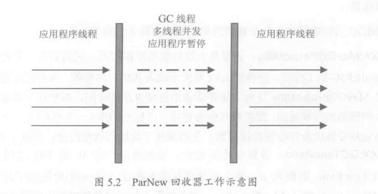
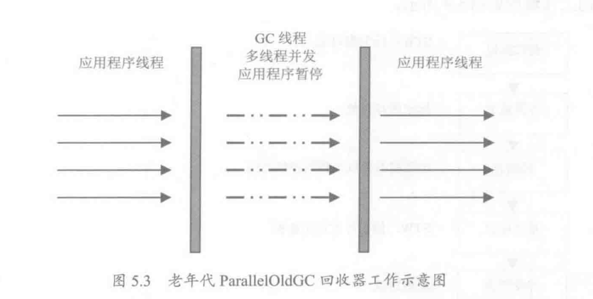
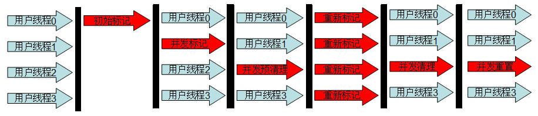
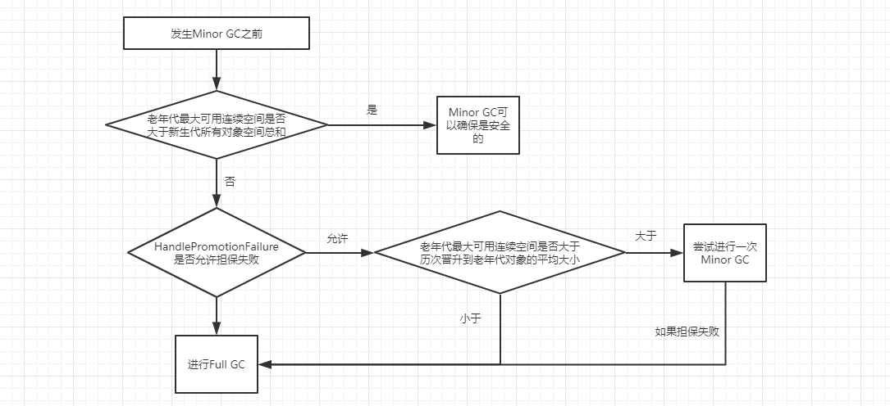

前言：

本文环境是jdk7、8


# 引用级别

## 强引用

- 强引用可以直接访问目标对象
- 强引用指向得对象，任何时候都不会被回收，虚拟机宁愿抛出OOM异常也不会回收强引用所指向的对象
- 强引用可能会导致内存泄漏


## 软引用

java.lang.ref.SoftReference

一个对象只持有软引用，当堆空间不足时，会被回收

每一个软引用都可以附带一个引用队列，当对象的可达性状态发生改变时（由可达变成不可达），软引用对象就会进入引用队列，可以跟踪对象的回收情况

```java
public class SoftRef {
    static class User{
        public int id;
        public String name;
        public User(int id, String name) {
            this.id = id;
            this.name = name;
        }
        @Override
        public String toString() {
            return "User{" +
                    "id=" + id +
                    ", name='" + name + '\'' +
                    '}';
        }
    }


    public static void main(String[] args) {
        User user = new User(1, "cxk");
        SoftReference<User> soft = new SoftReference<>(user);
        user = null; // 解除强引用
        System.gc(); // 内存足够，软引用所指向的对象不会被回收
        System.out.println(soft.get());

        // 分配大对象
        byte[] b = new byte[1024*930*7]; // 这个申请的大小需要自己调整，如果太大会导致堆溢出
        System.gc();
        System.out.println(soft.get());
    }
}
```


## 弱引用

WeekReference

在gc时，只要发现弱引用的对象，就会被回收


## 虚引用

PhantomReference

和没有引用几乎是一样的，随时会被垃圾回收器回收，当试图通过虚引用的get()方法取得强引用时，总会失败，并且虚引用必须和引用队列一起使用，他的作用在于跟踪垃圾回收过程


# 垃圾回收器

## 串行回收器

单线程进行垃圾回收，垃圾回收时暂停所有用户线程

### 新生代串行回收器

Serial

复制算法

### 老年代串行回收器

Serial Old

标记整理算法

### jvm参数

- -XX:+UseSerialGC  新生代，老年代都使用串行回收器
- -XX:+UseParNewGC  新生代使用ParNew回收器，老年代使用串行收集器
- -XX:+UseParallelGC 新生代使用ParallelGC回收器，老年代使用串行收集器
- -XX:SurvivorRatio 设置eden区和survivor区大小比例
- -XX:PretenureSizeThreshold 当对象大小超过这个阈值，对象直接在老年带分配
- -XX:MaxTenuringThreshold 设置对象进入老年代的年龄最大值，每一次Minor GC后，对象年龄加1

## 并行回收器

- 使用多线程进行垃圾回收
- 对于并行能力强的计算机可以有效缩短垃圾回收所需要的时间

### 新生代ParNew



#### 简介

- 工作在新生代
- 使用复制算法
- Serial收集器的多线程版本
- 垃圾收集时暂停所有用户线程

#### jvm参数

- -XX:UseParNewGC   新生代使用ParNew回收器，老年代使用串行回收器
- -XX:UseConcMarkSweepGC   新生代使用ParNew回收器，老年代使用CMS

- -XX:ParallelGCThreads   ParNew回收器的线程数量

### 新生代ParallelGC回收器

#### 简介

- 使用复制算法

- 与ParNew一样，都是多线程、垃圾收集时暂停所有用户线程

- ParallelGC非常关注系统吞吐量

- 拥有自适应调节策略

  - 通过-XX:+UseAdaptiveSizePolicy开启

  - 开启之后，不需要手动指定新生代大小(-Xmn)、eden和survivor的比例(-XX:SurvivorRatio)、晋升老年代的对象年龄(--XX:MaxTenuringThreshold)，垃圾收集器会自动调节这些参数。

  - 只需设置最大堆(-Xmx)，然后设置MaxGCPauseMillis(更关注最大停顿时间)或者GCTimeRatio(更关注吞吐量)

    

> 吞吐量=运行用户代码的时间/（运行用户代码的时间+垃圾回收的时间）
>
> 高吞吐量可以高效利用CPU时间，尽快完成程序运算任务，主要适合在后台运算而不需要太多交互的任务

#### jvm参数

- -XX:+UseParallelGC 新生代使用ParallelGC回收器，老年代使用串行回收器
- -XX:+UseParallelOldGC 新生代使用Parallel回收器，老年代使用ParallelOldGC
- 提供了两个参数用于控制吞吐量
  - -XX:MaxGCPauseMillis 最大垃圾收集停顿时间，ParallelGC在工作时
  - -XX:GCTimeRatio   设置吞吐量大小，值是一个0到100的整数，如果GCTimeRatio的值为n，那么系统将花费不超过1/(1+n)的时间用于垃圾收集

### 老年代ParallelOldGC



#### 简介

- 关注吞吐量
- 垃圾回收多线程
- 垃圾回收时，用户线程全部暂停
- 使用标记-整理算法

#### jvm参数

- -XX:UseParallelOldGC 新生代使用Parallel回收器，老年代使用ParallelOldGC

## CMS回收器

### 简介

- 全称：Concurrent Mark Sweep 并发标记清除
- 使用标记清除算法
- 关注于系统停顿时间

### 工作步骤



1、**初始标记**：stop the world，标记GC Roots能直接关联的对象，速度很快

2、**并发标记**：在初始标记的基础上，继续向下标记

3、**重新标记** ：stop the world，修正并发标记期间因用户线程继续运作而导致标记产生变动的那一部分对象的标记记录

4、**并发清理** ：清理垃圾对象，这个阶段收集器线程和应用程序线程并发执行。

> https://docs.oracle.com/javase/8/docs/technotes/guides/vm/gctuning/cms.html#sthref38>
>
> ## Scheduling Pauses
>
> The pauses for the young generation collection and the tenured generation collection occur independently. They do not overlap, but may occur in quick succession such that the pause from one collection, immediately followed by one from the other collection, can appear to be a single, longer pause. To avoid this, the CMS collector attempts to schedule the remark pause roughly midway between the previous and next young generation pauses. This scheduling is currently not done for the initial mark pause, which is usually much shorter than the remark pause.
>
> 大概意思就是：重新标记耗时较长，一般会安排在两次新生代gc之间

### 缺点

1、并发阶段，会占用一部分线程用于垃圾收集，导致应用程序变慢，总吞吐量降低

2、CMS无法处浮动垃圾，可能出现Concurrent Mode Failure

- **浮动垃圾**：并发清理阶段，由于用户线程运行而新增的垃圾，无法在这次垃圾清理被回收

- **Concurrent Mode Failure**：并发清理阶段，用户线程还在运行，此时老年代还需要预留一部分空间出来。如果在CMS运行期间，预留的空间不够用，就会出现Concurrent Mode Failure，这时就会启用Serial Old来重新进行老年代的垃圾回收，这样停顿时间就变长了

  > -XX:CMSInitiatingOccupancyFraction = 0-100的整数，表示老年代空间使用多少，就启动CMS垃圾回收（默认值是68）

3、CMS基于标记-清除算法，会产生内存碎片，整理碎片需要Stop The World

> （1）-XX:+UseCMSCompactAtFullCollection 
>
> 默认开启，垃圾收集后进行碎片整理
>
> （2）-XX:CMSFullGCsBeforeCompaction
>
> 设定多少次CMS回收就进行碎片整理
>
> （默认值是0，表示每次进入Full GC时都进行碎片整理）

### jvm参数

- -XX:UseConcMarkSweepGC 新生代使用ParNew回收器，老年代使用CMS

- -XX:ConcGCThreads

  标志-XX:ConcGCThreads=<value>(早期JVM版本也叫-XX:ParallelCMSThreads)定义并发CMS过程运行时的线程数。比如value=4意味着CMS周期的所有阶段都以4个线程来执行。尽管更多的线程会加快并发CMS过程，但其也会带来额外的同步开销。因此，对于特定的应用程序，应该通过测试来判断增加CMS线程数是否真的能够带来性能的提升。

  如果标志未设置，JVM会根据并行收集器中的-XX:ParallelGCThreads参数的值来计算出默认的并行CMS线程数。该公式是ConcGCThreads = (ParallelGCThreads + 3)/4。因此，对于CMS收集器， `-XX:ParallelGCThreads标志不仅影响“stop-the-world”垃圾收集阶段，还影响并发阶段。`

> ParallelGCThreads 并行时gc线程数目（stop the world阶段）
>
>  ConcGCThreads或者ParallelCMSThreads 并发时gc线程数目（gc线程与应用线程并发阶段）

## G1回收器

### 简介：

Garbage-First，在jdk1.7正式使用

特点：

- G1工作在年轻代、和老年代。

- 面向服务端应用的垃圾收集器，追求低停顿

- 运行期间不会产生内存碎片（在两个Region之中进行复制）

- 可预测的停顿，相对于CMS的一个优势，G1除了追求低停顿外，还能指定在M毫秒的时间片内，消耗在垃圾收集的时间不得超过N毫秒

- G1将堆分为很多大小相等的Region, 每次收集时会判断各个Region的活性(即垃圾对象的占比)，垃圾对象占比越多的Region回收的收益越大，然后G1会按照设置的停顿时间目标、前几次回收Region所用时间来估算要回收哪些Region，即用最小的时间获取最大的收益

- 当申请的对象大于Region大小的一半时，会被放入一个Humongous Region(巨型区域)中

  


Remember Sets（简称RS）:

- 一个Region对应一个RS
- 每个RS记录了对应的Region中哪些对象被其他区域引用
- 因此可以避免全堆扫描，要确定region中的垃圾，只需要查找RS即可

### 工作步骤

**一、G1并发标记周期（必定帮随一次Young GC）：**

- **初始标记**：STW，标记出所有可以直接从GC roots可以到达的对象，这是在Young GC的暂停收集阶段顺带进行的。
- **根区域扫描**：找出所有的GC Roots的Region
- **并发标记阶段**：G1通过tracing找出整个堆所有的可到达的对象
- **重新标记**：STW，修正并发标记阶段的结果
- **独占清理**：STW，计算Region的垃圾比例，并进行排序，找出mixed GC的Region候选列表
- **并发清理阶段**：把完全没有存活对象的Region直接放入空闲可用Region列表中


**二、混和回收（mixed GC）**


**三、Full GC**

和CMS一样，G1的一些收集过程是和应用程序并发执行的，所以可能还没有回收完成，是由于申请内存的速度比回收速度快，新的对象就占满了所有空间，在CMS中叫做Concurrent Mode Failure, 在G1中称为Allocation Failure，也会降级为一个STW的fullgc。

### jvm参数

- -XX:+UseG1GC 

- GC最大暂停时间，默认200ms

  ```java
  -XX:MaxGCPauseMillis=200
  ```

- 开始一个标记周期的堆占用比例阈值，默认45%，注意这里是整个堆，不同于CMS中的Old堆比例。

  ```java
  -XX:InitiatingHeapOccupancyPercent=45
  ```

- 设置每个Region的大小，这里需要是1MB到32MB的2的指数的大小。

  ```java
  -XX:G1HeapRegionSize=n
  ```

参考：

[Garbage First G1收集器 理解和原理分析](<https://liuzhengyang.github.io/2017/06/07/garbage-first-collector/>)


# 内存分配与回收策略

普遍的策略：

- 对象优先在eden区分配

- 大对象直接进入老年代

- 长期存活的对象进入老年代：每经过1次Minor GC存活下来的对象年龄加1，到达MaxTenuringThreshold后进入老年代 

- 并不是一定要年龄到达MaxTenuringThreshold后才进入老年代，如果在Survivor空间中相同年龄所有对象大小的总和>Survivor空间的一半，那么大于等于该年龄的对象直接进入老年代

- 空间分配担保：

  

  注意：jdk6 Update24之后，HandlePromotionFailure参数没有作用，只要老年代的连续空间大于新生代对象总大小或者历次晋升到老年代的平均大小，就会进行Minor GC，否则进行Full GC


参考：

[JVM实用参数系列](http://ifeve.com/useful-jvm-flags/)

《实战Java虚拟机》

[官方文档](https://docs.oracle.com/javase/8/docs/technotes/guides/vm/gctuning/)

[Java Hotspot G1 GC的一些关键技术](https://tech.meituan.com/2016/09/23/g1.html)


