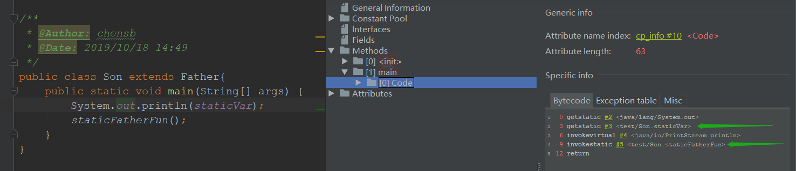

# 首先抛出问题：

子类继承父类，子类能使用父类的静态属性和方法，那么子类是怎么使用静态方法或者使用静态属性的？


# 例子

```java
public class Father {
    // 静态变量
    protected static int staticVar = 9;


    // 静态函数
    public static void staticFatherFun(){   
    }   
}


public class Son extends Father{
    public static void main(String[] args) {
        // 使用父类的静态属性
        System.out.println(staticVar);
        // 调用父类的静态方法
        staticFatherFun();
    }
}
```


# 探索

使用idea + jclasslib进行字节码文件分析


# 结论

子类可以使用父类的静态属性和方法，但是子类的字节码文件中中不存在父类静态属性和方法的信息

如果子类使用了父类的静态属性和方法，那么子类的运行时常量池有对应的**符号引用**

在**类解析阶段**会将符号引用直接转化为直接引用


子类使用父类静态属性和方法使用的字节码指令

- getstatic 静态属性符号引用
- invokestatic 静态方法符号引用




# 引申

如果是非静态属性：

当new一个子类时，会调用子类的<init>方法，该方法会去调用父类的<init>方法，因此new子类，在堆中会开辟一块空间，其中会包含父类的非静态属性。