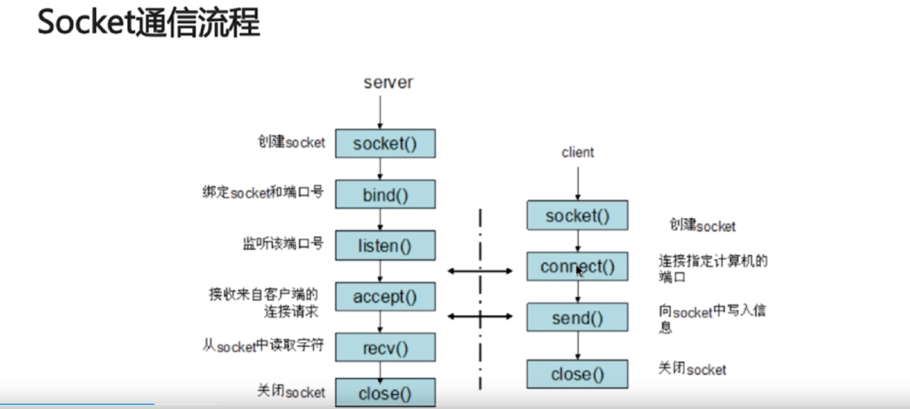

**HTTPS**

- 常称为HTTP over TLS、HTTP over SSL或HTTP Secure

  SSL/TLS建立在tcp和http之间（属于OSI七层模型中的会话层）

  SSL/TLS建立在tcp之上

  > SSL的全称是“Secure Socket Layer”，由网景公司发明，当发展到3.0时被标准化，改名为TLS， 即“Transport Layer Security”
  >
  > SSL使用了许多密码学最先进的研究成果，综合了对称加密、非对称加密、摘要算法、数字签名、数字证书 等技术，能够在不安全的环境中为通信的双方创建出一个秘密的、安全的传输通道，为HTTP套上一副坚固的盔甲。 

- 流程：

  - 建立tcp连接
  
  - 客户端发送请求
  
    浏览器将支持的加密算法信息发给服务器
  
  - 服务端返回证书
  
  - 客户端校验证书的有效性，然后从中获得公钥，随机生成一个密钥，将该密钥用公钥加密发给服务端
  
  - 服务端使用私钥解密，拿出密钥
  
  - 接下来就使用该密钥进行对称加密

**HTTP常见状态码**

- 200 OK 服务器成功处理了请求（这个是我们见到最多的）
- 301/302 Moved Permanently（重定向）请求的URL已移走。Response中应该包含一个Location URL, 说明资源现在所处的位置
- 304 Not Modified（未修改）客户的缓存资源是最新的， 要客户端使用缓存
- 404 Not Found 未找到资源
- 501 Internal Server Error服务器遇到一个错误，使其无法对请求提供服务

**加密方式**

- 对称加密：加密和解密都是使用同一个密钥

- 非对称加密：加密解密使用的密钥不同

- 哈希算法：将任意长度的信息转化为固定长度的值，算法不可逆（MD5）

- 数字签名：证明某个消息或者文件是某人发出的

  eg：签名就是在信息的后面加上一段内容，

