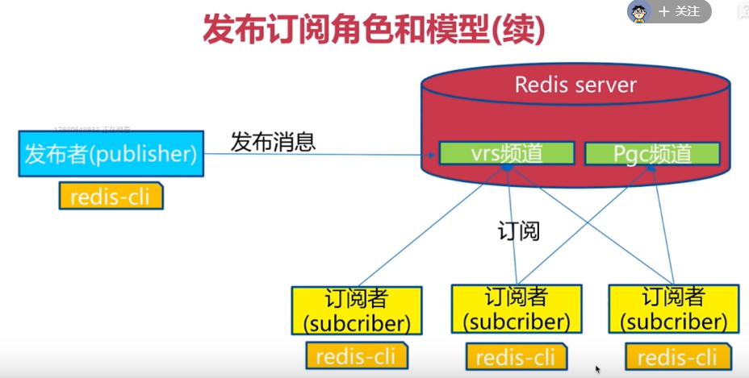

# 互联网架构演变

1. **单机MySQL**
2. **Memcached(缓存) + MySQL + 垂直分离**

 + MySQL + 垂直分离.JPG)

> 什么是垂直分离？
>
> 系统设计时，设计多个数据库，不同数据库存储不同模块数据

3. **MySQL主从复制来实现读写分离**

   写操作放在主库，读操作放在从库

   - 什么是主从复制？

     将多个数据库分为主和从，主数据库插入一条新数据，从数据库立马更新

   - 什么是读写分离？

     读和写操作放在不同的数据库

4. **分表分库+水平拆分+MySQL集群**

5. **如今**

   - Nginx负载均衡
   - App应用服务器集群（多个tomcat）
   - MySQL集群
   - 专用的文件服务器，图片服务器.....

# NoSql

## 是什么

- Not only SQL

  Redis(key-value/cache/persistence)，Memcache，Mongdb

- CAP定理

  1. 内容:
     - Consistency(强一致性)
     - Availability(可用性)
     - Partition tolerance(分区容错性)
  2. CAP三个特性，三选二

  > <http://www.ruanyifeng.com/blog/2018/07/cap.html>

- NoSQL分类

  - key-value
  - 文档型数据库（bson格式比较多）
  - 列式存储数据库
  - 图关系数据库


## 为什么用?

- 易扩展

  eg:比如用户表的字段是有限制的，如果要增加微信号这个字段，需要alter表的结构

- 大数据量高性能

- 多样灵活的数据模型

> 补充：
>
> 3V+3高：
>
> - 大数据时代3V
>   - 海量Volume
>   - 多样Variety  一条微博包含文本，图片，视频。。。
>   - 实时Velocity
> - 互联网需求的3高
>   - 高并发
>   - 高可扩：一台机器不行，扩展多台
>   - 高性能

## 实例：

以阿里巴巴商品信息数据存放为例

- 商品基本信息 不怎么变，放在MySQL

- 商品描述、详情、评价信息（多文字类型数据） MongDB

- 商品图片 分布式文件系统 Hadoop

- 商品的关键字 ISearch

- 商品的波段性的热点高频信息 内存数据库（Tail,Redis,Mencache）

  eg：比如情人节，巧克力

> 补充：
>
> 分布式：不同服务器部署不同的服务模块，他们之间通过RPC/RMI进行通信和调用，对外提供服务和组内协作
>
> 集群：不同的服务器部署相同的功能模块，通过分布式调度软件进行统一的调度，对外提供服务


## 总结NoSQL 与 SQL 的区别

- SQL固定的数据模式，NoSQL则没有

  eg:sql需要定义表的结构，定义完之后很难改变；而NoSQL比如采用json存储数据，更方便扩展

- NoSQL是分布式的，很容易进行水平扩展（增加更多的机器）

- sql遵循事务ACID，NoSQL遵循CAP定理

  


# Redis

REmote DIctionary Server (远程字典服务器)

高性能的(**key/value**)分布式内存数据库，基于**内存**运行，并支持**持久化**的NoSQL数据库


## 边缘知识点

- 单进程，使用Linux的epoll

- 默认16个数据库，默认使用0号数据库

  通过select 命令切换数据库

- Dbsize查看当前数据库的key数量

- keys *  （查看所有key）

  keys k? （问号表示占位符）

- flushdb 删除当前库的key-value

  flushall 删除所有库的key-value


## key相关

- keys *
- exists key
- move key db
- expire key 秒钟  -- 为给定的key设置过期时间
- ttl key 查看还有多少秒过期，-1表示永不过期，-2表示已经过期（ttl--time to live）
- type key 查看key的类型


## Redis数据类型

### String字符串

- set/get/del/append/strlen
- incr/decr/incrby/decrby
- getrange/setrange
- setex(set with expire)/setnx(set if not exist)

- mset/mget/msetnx
- getset(先get再set)

### List 列表

- lpush/rpush/lrange
- lpop/rpop
- lindex 按照索引下标获取元素
- llen
- lrem key n value 删除n个value
-  LTRIM key start stop 截取[start , stop] 再赋值给key
- RPOPLPUSH source destination 
- LSET key index value
- LINSERT key BEFORE|AFTER pivot value

总结：

1. 字符串双向链表
2. 如果值全移除，对应的key不存在
3. 对头尾元素操作效率高

### Set 集合

- sadd/smembers/sismember
- scard 获取集合元素个数
- srem key value 删除集合中元素
- srandmember key n 随机取n个元素
- spop key 随机出栈
- smove key1 key2 value(from key1) 将value移到key2
- 数学集合
  - 差集sdiff
  - 交集sinter
  - 并集sunion


### Hash 哈希

- hset/hget/hmset/hmget/hgetall/hdel
- hlen
- hexists key
- hkeys/hvals
- hincrby/hincrbyfloat
- hsetnx


### Zset 有序集合

- zadd 分数1 元素1 分数2 元素2 ....

- ZRANGE key start stop [WITHSCORES]

- ZRANGEBYSCORE key min max [WITHSCORES] [LIMIT offset count]

  ```shell
  # 注意（ 表示不包括
  # 下面的例子表示大于70小于90
  ZRANGEBYSCORE zset (70 (90 withscores
  ```

- ZREM key member [member ...]

- zcard 统计元素个数

- ZCOUNT key min max 统计大于等于min小于等于max的元素个数

- ZREVRANGE key start stop [WITHSCORES] 逆序下标

- zrank key member (根据score排序的下标位置)/ zrevrank key member

  

## Redis配置文件

#### loglevel 

日志记录级别

Redis支持四个级别debug、verbose(默认)、notice、warning

#### logfile stdout

日志记录输出，默认为标准输出

#### tcp-backlog

```shell
# TCP listen() backlog.
#
# In high requests-per-second environments you need an high backlog in order
# to avoid slow clients connections issues. Note that the Linux kernel
# will silently truncate it to the value of /proc/sys/net/core/somaxconn so
# make sure to raise both the value of somaxconn and tcp_max_syn_backlog
# in order to get the desired effect. 
tcp-backlog 511
```
解释：backlog是一个连接队列 = 已经完成三次握手的连接，将其作为函数listen(int sockfd, int backlog)的第二个参数

> **注意：Linux backlog/somaxconn 内核参数**
>
> 对于监听函数int listen(int sockfd, int backlog);
> backlog 参数描述的是服务器端 TCP ESTABELLISHED 状态对应的全连接队列长度。
>
> 全连接队列长度如何计算？
> 如果 backlog 大于内核参数 net.core.somaxconn，则以 net.core.somaxconn 为准，
> 即全连接队列长度 = min(backlog, 内核参数 net.core.somaxconn)，net.core.somaxconn 默认为 128。
>
> 半连接队列长度如何计算？
> 半连接队列长度由内核参数 tcp_max_syn_backlog 决定，
> 当使用 SYN Cookie 时（就是内核参数 net.ipv4.tcp_syncookies = 1），这个参数无效，
> 半连接队列长度 = min(backlog, 内核参数 net.core.somaxconn，内核参数 tcp_max_syn_backlog)。
> 这个公式实际上规定半连接队列长度不能超过全连接队列长度。
>
> 摘自<https://jaminzhang.github.io/linux/understand-Linux-backlog-and-somaxconn-kernel-arguments/**>

#### timeout

客户端连接空闲多少秒就关闭，0表示禁用该功能

```shell
# Close the connection after a client is idle for N seconds (0 to disable)
timeout 0
```

#### maxclients

最大客户端，默认10000

> 注意maxclients 与 backlog的区别
>
> backlog并不是TCP最大连接数，而是和accept队列有关，可以理解为进程还没有accept的TCP连接的队列，如果accept了，就不在这个队列里了。
>
> 需要了解linux中socket相关知识<https://www.jianshu.com/p/e6f2036621f4>

####maxmemory 

最大内存限制 

#### maxmemory-policy

达到最大内存之后使用的策略(默认是noeviction)

```shell
# volatile-lru -> Evict using approximated LRU among the keys with an expire set.（在有设置过期时间的key钟使用lru算法清除缓存）

# allkeys-lru -> Evict any key using approximated LRU.（对所有的key使用LRU）

# volatile-lfu -> Evict using approximated LFU among the keys with an expire set.

# allkeys-lfu -> Evict any key using approximated LFU.

# volatile-random -> Remove a random key among the ones with an expire set.

# allkeys-random -> Remove a random key, any key.（随机移除）

# volatile-ttl -> Remove the key with the nearest expire time (minor TTL)（移除将要过期的缓存）

# noeviction -> Don't evict anything, just return an error on write operations.(永不过期)
```

#### maxmemory-samples 

默认值是5，表示样本数目，Redis会检查5个样本，然后选择最近最少使用。这个值越高，结果越精确，会更消耗cpu


## 持久化

### RDB（Redis DataBase）

1. 是什么？

   RDB持久化方式能够在指定的时间间隔能对你的数据进行快照存储，产生一个RDB文件

2. 相关配置

   ```shell
   # 设置什么条件更新RDB文件save <seconds> <changes>
   save 900 1 # 15分钟内1次keys改变
   save 300 10 # 5分钟内10次keys改变 
   save 60 10000 # 1分钟内1万次keys改变
   
   # 当bgsave出现错误时，Redis是否停止执行写命令；
   # 设置为yes，则当硬盘出现问题时，可以及时发现，避免数据的大量丢失；
   # 设置为no，则Redis无视bgsave的错误继续执行写命令，当对Redis服务器的系统(尤其是硬盘)使用了监控时，该选项考虑设置为no
   stop-writes-on-bgsave-error yes
   
   # 在进行镜像备份时,是否进行压缩。yes：压缩，但是需要一些cpu的消耗。no：不压缩，需要更多的磁盘空间
   rdbcompression yes
   
   # 是否开启RDB文件校验，开启会增加10%的性能消耗
   rdbchecksum yes
   
   # 数据库文件的文件名
   dbfilename dump.rdb
   
   # 数据目录
   # 该值可以通过config get dir 命令得到
   dir ./
   ```

3. 发生持久化的情况：

   - SAVE命令：**save 命令会阻塞Redis服务器进程，直到RDB文件创建完毕为止，在阻塞期间，不能处理任何命令请求

   - **BGSAVE命令：** fork出一个子进程，由子进程负责创建RDB文件，，服务器进程继续处理命令请求
   - flushall 此时保存一个空数据库，无意义
   - shutdown 会在退出之前存一次快照

4. 自动间隔性保存

   - 通过设置配置文件 save <seconds> <changes>

   - 使用的是BGSAVE方式

### AOF(Append Only File)

1. 是什么？

   如果使用RDB，当redis突发故障时，有可能丢失上一次快照之后更新的数据

   使用AOF， 每当 Redis 执行一个改变数据集的命令时（比如 SET）， 这个命令就会被追加到 AOF 文件的末尾， 当 Redis 重新启时， 程序就可以通过重新执行 AOF 文件中的命令来达到重建数据集的目的。

2. 相关配置

   ```shell
   # 默认关闭 AOF
   appendonly no
   
   # AOF文件名
   appendfilename "appendonly.aof"
   
   # The fsync() call tells the Operating System to actually write data on disk
   # instead of waiting for more data in the output buffer. Some OS will really flush
   # data on disk, some other OS will just try to do it ASAP.
   # Redis supports three different modes:
   # no: don't fsync, just let the OS flush the data when it wants. Faster.（让操作系统自己决定什么时候写磁盘）
   # always: fsync after every write to the append only log. Slow, Safest.(文件一有增加就立马写磁盘)
   # everysec: fsync only one time every second. Compromise.（每隔1秒磁盘）
   # appendfsync always
   appendfsync everysec
   # appendfsync no
   
   
   ```

3. AOF重写

   - 在实际生产环境中，AOF文件的体积会迅速膨胀

     AOF重写就是为了减小AOF的体积

     举一个重写的例子，比如一个list，对其做了一万次操作，那么AOF文件需要保存这一万条记录，重写最简单的方法就是去掉这一万条操作记录，直接对读取现有的list，然后增加一条lpush list .....命令

   ```shell
   # 重写的时候 是否可以 同步缓冲区的记录到磁盘中
   # 用默认no即可，保证数据安全性
   no-appendfsync-on-rewrite no
   
   
   #Redis会记录上次重写时的AOF大小，默认配置是当AOF文件大小是上次rewrite后大小增加了1倍且文件大于64M时触发。
   #auto-aof-rewrite-percentage 100的意思是增加了100%，也就是增加了一倍
   auto-aof-rewrite-percentage 100
   # AOF文件到达64M的时候自动重写，实际生产中，一般这个值要设置3G起步
   auto-aof-rewrite-min-size 64mb
   
   ```

   - **重写原理**

   ​            AOF文件持续增长而过大时，会**fork**出一条新进程来将文件重写(也是先写临时文件最后再rename)，遍历新进程的内存中数据，每条记录有一条的Set语句。

4. 修复AOF文件

   RDB和AOF可以同时启用，redis启动时会找AOF文件，如果AOF文件损坏，则启动Redis失败，可以使用redis-check-aof修复之后再重新启动

   ```shell
   redis-check-aof --fix AOF文件
   ```

   

### 总结

- RDB持久化方式能够在指定的**时间间隔**能对你的数据进行快照存储
- AOF开启之后，Redis挂掉，最多丢失不超过2秒的数据
- 如果只用到Redis缓存功能，可以不使用持久化功能


## Redis 事务

- 相关命令

  multi 开启事务

  exec 提交事务

  discard 取消事务

- Redis没有完全支持事务

  eg: 多个命令，如果中间有个命令在运行时候报错，那么不会影响其他命令的执行

  ```shell
  127.0.0.1:6379> MULTI
  OK
  127.0.0.1:6379> set k2 v2
  QUEUED
  127.0.0.1:6379> INCR k1
  QUEUED
  127.0.0.1:6379> get k1
  QUEUED
  127.0.0.1:6379> incr k2	# 运行时候发现错误
  QUEUED
  127.0.0.1:6379> get k2
  QUEUED
  127.0.0.1:6379> EXEC
  1) OK
  2) (integer) 2
  3) "2"
  4) (error) ERR value is not an integer or out of range
  5) "v2"
  ```

- watch

  监视一个或者多个key，当key被其他事务修改时，当exec整个事务队列都不执行

  监控一直持续到EXEC命令（事务中的命令是在EXEC之后才执行的，所以在MULTI命令后可以修改WATCH监控的键值）

## 主从复制

1. 如何配置

   - 配置文件redis.conf

     ```shell
     slaveof <masterip> <masterport>
     ```

   - 在启动redis时指定

     ```shell
     redis-server --slaveof <masterip> <masterport>
     ```

   - 在客户端配置

     ```shell
     slaveof <masterip> <masterport>
     ```

2. slave断开与master的联系

   ```shell
   slaveof no one
   ```

3. 其他知识点
   1. 相关命令

      - info replication查看信息

   2. 只有master可以写，slave写会报错

   3. master挂了，slave保持不变，不会变为master

   4. slave每次与master断开之后，都需要重新配置为slave，除非修改配置文件

   5. 主从配置的两种方式

      - 中心化

      - 链式

        - 优点：减小了中心master的压力
        - 缺点：数据备份存在延时


## 哨兵（Redis Sentinel）


## 集群（Redis Cluster）


## 慢查询

1. 两个配置

   ```shell
   # 慢查询阈值 （单位：微秒）
   slowlog-log-slower-than 10000
   # 慢查询队列最大长度
   slowlog-max-len 128
   ```

   无需重启redis，支持动态配置

   ```shell
   config set slowlog-log-slower-than 数值
   ```

2. 特点：

   - 先进先出队列
   - 固定长度
   - 保存在内存中

3. 慢查询相关命令

   ```shell
   # 获取慢查询队列
   slowlog get [n]
   # 获取慢查询队列长度
   showlog len
   # 清空慢查询队列
   slowlog reset
   ```

4. 慢查询相关经验
   - slowlog-log-slower-than 不要设置过大默认10ms,通常1ms
   - slowlog-max-len 不要设置过小，通常1000左右
   - 定期持久化慢查询 （方便分析历史记录，查找问题）


## 流水线（pipeline）

1. **是什么**？

   就是将一批命令打包，一次性发给redis-server

   以前n条命令的时间为 N次网络往返时间+N次命令执行时间

   使用了流水线之后，1次网络往返时间+N次命令执行时间

2. 建议：

   - 每次pipeline携带的数据量
   - pipeline只能作用在一个Redis节点上
   - M操作（mset等等）到服务端之后是作为一个整体执行，而pipeline不是


## 发布订阅

1. **角色：**

   - 发布者
   - 订阅者
   - 频道

   

2. **相关命令**

   - subscribe [channel] # 一个或者多个
   - unsubscribe 取消订阅
   - publish channel message

3. **消息队列与发布订阅的比较**

   - 如果消息队列有一个消息，那么该消息只被**一个**消费者拿到
   - 发布订阅模型，发布之后，相关订阅者都能收到


## Redis为什么快？

1. 基于内存操作
2. 单线程，指的是处理网络请求命令这个模块，减少了上下文切换，无需要保证线程安全
3. 非阻塞IO - IO多路复用

<https://blog.csdn.net/bird73/article/details/79792548>


## Redis典型应用场景

- 缓存

  eg:客户请求数据，不直接从数据库拿数据，先从内存拿，拿不到再去数据库拿，拿完缓存一份在内存，返回给客户

- 计数器

  eg:微博的转发数，评论数，因为redis

- 消息队列系统

  eg:简单的消息队列

- 排行榜

  eg:利用redis提供的zset


## 其他

- 测试redis性能

  src文件夹下运行redis-benchmark

- config get * 可以获取redis相关配置

- linux中把配置文件中的注释去掉

  ```
  cat redis.conf | grep -v "#" | grep -v "^$" 
  ```

  

## 参考资料

Redis 命令参考http://redisdoc.com/

Redis持久化<http://www.redis.cn/topics/persistence.html>

