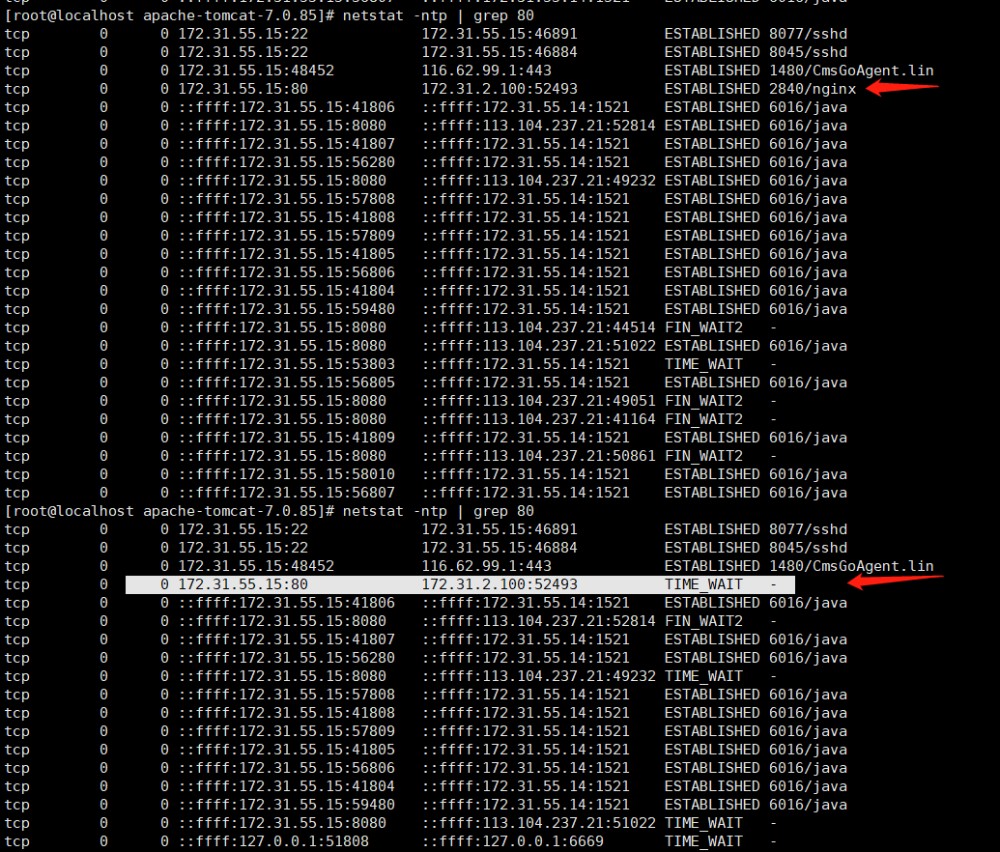
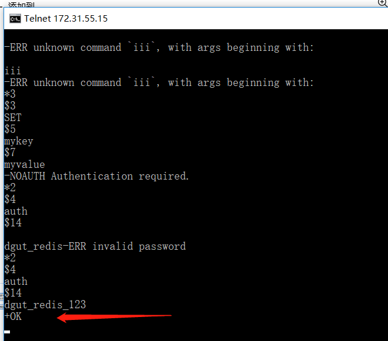
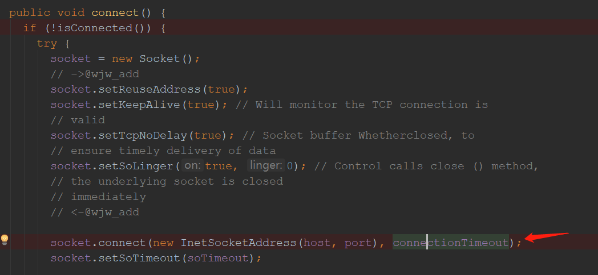

# 问题

本地计算机A，mysql、redis部署在机子B上，A访问B需要开VPN（Easyconnet客户端）

- 在项目使用jdbc连接mysql数据库，失败
- 在项目使用jedis连接redis，失败

- 对于mysql数据库，使用Navicat、SQLyog这些都能连接成功

- 使用telnet连接 B 的6379端口（redis在服务器B的监听端口），能连接成功

  


# 问题排查步骤

1. 首先看配置文件redis.conf

   ```shell
   bind
   protected-mode
   requirepass 
   ```

2. 查看B的防火墙

   ```shell
   service iptables status
   ```

3. 查看B的tcp监听端口

    ```shell
   netstat -ltps
   ```


# 踩坑过程




(1)连接 80端口

telnet 172.31.55.15 80

(2)断开

**分析：**

我们的本地机子A开了vpn，分配得到的内网ip是172.32.2.104

B机子的内网ip是172.31.55.15

但是从图中可以看到与B建立tcp连接的服务器ip是 172.31.2.100

**猜测：**

因此我们的请求实际是发给172.32.2.100，该主机帮我们转发


使用telnet ， 本机（172.32.2.104） 与uat 的 6379 建立tcp连接，发现建立成功，并能进行交互



查看建立的tcp连接


推测：

使用telnet能够连redis，证明本地通过代理连redis没问题

可能问题出现在jedis，jedis使用原生socket建立连接，可能不走系统的代理，因此目的主机172.31.55.15不存在，所以会返回socket超时




网上看到类似的问题：

[项目里不能通过VPN访问外网数据库](https://blog.csdn.net/u012310865/article/details/80257607)