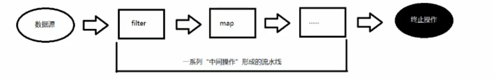

# Stream API

## 简介

- 定义在java.util.stream
- 使用Stream API对集合数据进行操作，可以类比写sql查数据库
- 也可以使用Stream APl 来并行执行操作


**Stream和Collection集合的区别：**

- Collection是静态的内存数据结构，而Stream是有关计算

- Stream面向CPU，Colletion集合面向内存


**注意：**

- Stream自己不会存储元素
- Stream不会改变源数据，会返回一个持有结果的新Stream
- Stream操作是延迟执行的，因此会操作会等到需要结果才执行


**Stream操作的三个步骤**

1. 创建Stream

   一个数据源（如数组、集合），获取一个流

2. 中间操作

   一个中间操作链，对数据源的数据进行处理

3. 终止操作

   一旦终止操作，就执行中间操作链，产生结果，之后不会再被使用

   


## 使用

### 创建Stream的四种方式

#### 一、通过集合

```java
 // 一、通过集合
List<String> list = new LinkedList<>();
list.add("a");
list.add("b");
list.add("c");
Stream<String> stream = list.stream();


// 可以看到Collection接口中存在默认方法实现
public interface Collection{
    // 返回一个连续的流
    default Stream<E> stream() {
        return StreamSupport.stream(spliterator(), false);
    }
    // 返回一个并行的流
    default Stream<E> parallelStream() {
        return StreamSupport.stream(spliterator(), true);
    }
}
```


#### 二、通过数组

```java
// 二、通过数组
// 调用Arrays的静态方法
String[] arr = new String[]{"a", "b", "c"};
Stream<String> stream1 = Arrays.stream(arr);
```


#### 三、通过Stream的of静态方法

```java
Stream<Integer> integerStream = Stream.of(1, 2, 3);
```


#### 四、创建无限流

```java
// 迭代
// iterate(初始值, 输入输出类型一致的lambada表达式)
// eg: 迭代出10个偶数，0 0+2 2+2 4+2 ....
Stream.iterate(0, a->a+2).limit(10).forEach(System.out::println);

// 生成
// generate(返回一个值的lambada表达式)
// eg:生成10个随机100内的整数
Stream.generate(()->{
    Random random = new Random();
    return random.nextInt(100);
}).limit(10).forEach(System.out::println);
```


### Stream的中间操作

#### 一、筛选与切片

- filter
- limit
- skip
- distinct

```java
Stream<String> stream = Stream.of("a", "pear", "b", "apple", "c", "kid");
// 找出所有字符串长度为1的字符串
stream.filter(s->s.length()==1).forEach(System.out::println);

输出：
a
b
c
```


#### 二、映射

- map
- flagMap

```java
String[] strs = new String[]{"aa", "bbb", "ccc"};
// 使用map，将字符串映射为长度
Stream<String> stream = Arrays.stream(strs);
stream.map(String::length).forEach(System.out::println);

输出：
2
3
3
```


#### 三、排序

- sorted

```java
List<Integer> integers = Arrays.asList(12, 34, 1, 5, 12);
// 自然排序
integers.stream().sorted().forEach(System.out::println);
// 自定义比较器
integers.stream()
    .sorted((o1, o2)->Integer.compare(o2, o1))
    .forEach(System.out::println);


输出：
1
5
12
12
34
34
12
12
5
1
```


### Stream终止操作

#### 一、查找与匹配

```java
public class Employee {
    private Long id;
    private String name;
    private Integer age;
    private Double salary;
}
```

```java
List<Employee> allEmployee = EmployeeService.getAllEmployee();

// 是否 所有人age>30
boolean allMatch = allEmployee.stream().allMatch(e->e.getAge()>30);
System.out.println(allMatch);

// 是否 没有一个人的工资大于2万
boolean noneMatch = allEmployee.stream().noneMatch(e -> e.getSalary() > 200000);
System.out.println(noneMatch);

// 是否 有人姓王
boolean anyMatch = allEmployee.stream().anyMatch(e -> e.getName().startsWith("王"));
System.out.println(anyMatch);

// 拿第一个元素
Optional<Employee> first = allEmployee.stream().findFirst();
System.out.println(first);

// 返回当前流的任意元素
Optional<Employee> any = allEmployee.stream().findAny();
System.out.println(any);

// 返回流中的元素个数
long count = allEmployee.stream().count();
System.out.println(count);

// 返回最大年龄的员工
Optional<Employee> max = allEmployee
.stream()
.max((e1, e2)->Integer.compare(e1.getAge(), e2.getAge()));
System.out.println(max);

// 返回最少工资
Optional<Double> min = allEmployee.stream().map(Employee::getSalary)
.min(Double::compareTo);
System.out.println(min);
```


#### 二、规约

```java
List<Employee> allEmployee = EmployeeService.getAllEmployee();
// 计算工资总和
Optional<Double> reduce = allEmployee.stream()
    .map(Employee::getSalary)
    .reduce((s1, s2) -> s1 + s2);
System.out.println(reduce);

// 计算自然数1到5
List<Integer> integers = Arrays.asList(1, 2, 3, 4, 5);
// 初始值为0
Integer sum = integers.stream().reduce(0, Integer::sum);
System.out.println(sum);
```


#### 三、收集

将流得到的数据放在容器中

用Collectors获取不同的容器

```java
List<Employee> allEmployee = EmployeeService.getAllEmployee();
// list
List<Employee> list = allEmployee.stream()
    .filter(e->e.getSalary()>5000)
    .collect(Collectors.toList());

// set
Set<Employee> set = allEmployee.stream()
    .filter(e->e.getSalary()>5000)
    .collect(Collectors.toSet());
```


