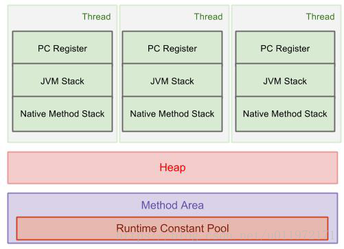
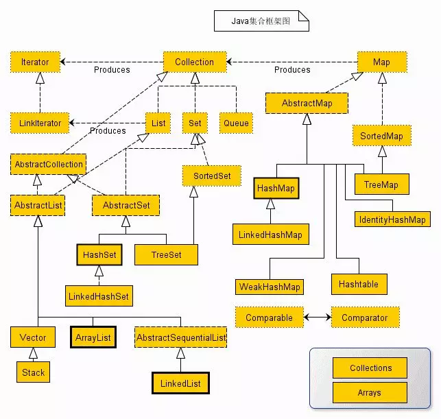
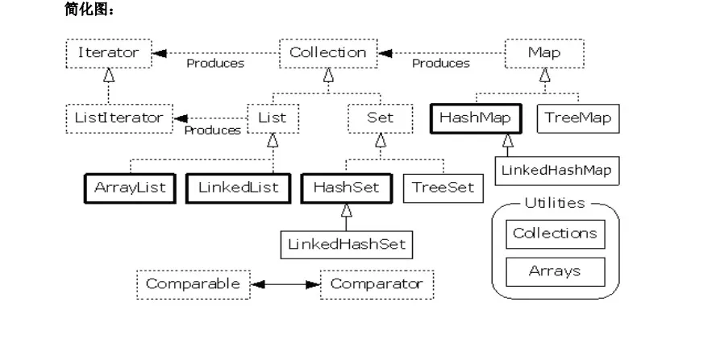
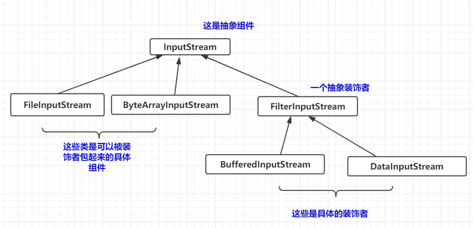
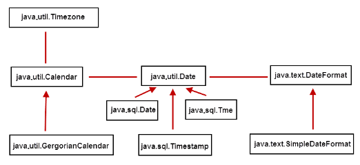

# 前言

- 这篇文章是对Java相关知识点的简要总结，主要记录了我个人之前所忽略的知识点

- 对于每个工具类的使用，这里不做详细探讨，具体可以参照官方文档，<https://docs.oracle.com/javase/8/docs/api/>


# 入门基础

- **Java程序运行机制**

   编译和解释结合

   	*.java 源文件   编译成  *.class 字节码文件
   	
   	jvm解释执行字节码文件
   > 面试题：Java是解释执行的，对吗？
   >
   > 解答：
   >
   > Java引进JIT技术之后，能将一些热点代码直接编译成机器语言
   >
   > JIT 是 just in time 的缩写, 也就是即时编译编译器。使用即时编译器技术，能够加速 Java 程序的执行速度。下面，就对该编译器技术做个简单的讲解。
   >
   > 首先，我们大家都知道，通常通过 javac 将程序源代码编译，转换成 java 字节码，JVM 通过解释字节码将其翻译成对应的机器指令，逐条读入，逐条解释翻译。很显然，经过解释执行，其执行速度必然会比可执行的二进制字节码程序慢很多。为了提高执行速度，引入了 JIT 技术。
   >
   > 在运行时 JIT 会把翻译过的机器码保存起来，以备下次使用，因此从理论上来说，采用该 JIT 技术可以接近以前纯编译技术。

- **jvm、jre、jdk**

   

- jar 包 就是一些字节码文件进行打包	

- **成员变量 与 局部变量**

   成员变量会自动初始化为默认值；局部变量必须先赋值才能使用

- **常量命名规范**：大写+下划线 如 MAX_VALUE

- **int范围**  -2^31 到 2^31-1

- **java浮点常量 可以用科学计数法表示**

   eg: 314e2=31400 

   		314E2=31400 
   	
   		314E-2=3.14 

- **switch语句中case标签**在JDK1.5之前必须是整数(long类型除外)或者枚举，不能是字符串，在JDK1.7之后允许使用字符串(String)。 

- **重载**：方法名相同，参数类型，个数，顺序不同


# 面向对象基础

- java 内存模型

  -

- **静态导入**

  jdk5之后的新特性 

  其作用是用于导入指定类的静态属性，这样我们可以直接使用静态属性。 

  ```java
  import static java.lang.Math.*;//导入Math类的所有静态属性
  import static java.lang.Math.PI;//导入Math类的PI属性
  ```

- **方法的重写需要符合下面的三个要点：**

  ​      1.“==”： 方法名、形参列表相同。

  ​      2.“≤”：返回值类型和声明异常类型，子类小于等于父类。

  ​      3.“≥”： 访问权限，子类大于等于父类。

- **访问权限修饰符 **

  | 修饰符    | 同一个类 | 同一个包 | 子类 | 所有类 |
  | --------- | -------- | -------- | ---- | ------ |
  | private   | *        |          |      |        |
  | default   | *        | *        |      |        |
  | protected | *        | *        | *    |        |
  | public    | *        | *        | *    | *      |

- **抽象类**

  有抽象方法的类，abstract关键字修饰

- **接口**

  - interface可以继承多个接口，class可以实现多个接口
  - 接口所有方法都是抽象，默认是 public abstract
  - 接口里面的变量，默认都是 public static final,(也即是接口里面只能定义常量)

- **匿名内部类**

  - 不会生成.class文件。只能使用一次
  - 匿名内部类中不能存在任何的静态成员变量和静态方法。
  - 匿名内部类没有*构造器*，可以使用*构造代码块*代替


# 异常机制

--

- Exception和Error的区别：Exception能被程序本身可以处理，Error是程序无法处理

- 需要注意的是，一旦某个catch捕获到匹配的异常类型，将进入异常处理代码。一经处理结束，就意味着整个try-catch语句结束。其他的catch子句不再有匹配和捕获异常类型的机会。

```java
package exception;

public class Demo {
    public static void checkZero(){
        for(int i=3;i>=-1;--i){
            int ans = 10/i;
            System.out.println("i=" + i);
        }
    }

    public static void main(String[] args) {
        try {
            checkZero();    // 一个异常只会被一个catch捕捉
        }catch (ArithmeticException mathException){
            System.out.println("catch ArithmeticException");
        }catch (Exception exception){
            System.out.println("catch Exception");
        }finally {
            System.out.print("finally");
        }
    }
}

/**
 * 执行结果：
 * i=3
 * i=2
 * i=1
 * catch ArithmeticException
 * finally
 */
```


# 容器





1、所有集合类都位于`java.util`包下。Java的集合类主要由两个接口派生而出：Collection和Map，Collection和Map是Java集合框架的根接口，这两个接口又包含了一些子接口或实现类。

2、集合接口：6个接口（短虚线表示），表示不同集合类型，是集合框架的基础。

3、抽象类：5个抽象类（长虚线表示），对集合接口的部分实现。可扩展为自定义集合类。

4、实现类：8个实现类（实线表示），对接口的具体实现。

5、Collection 接口是一组允许重复的对象。

6、Set 接口继承 Collection，集合元素不重复。

7、List 接口继承 Collection，允许重复，维护元素插入顺序。

8、Map接口是键－值对象，与Collection接口没有什么关系。

9、Set、List和Map可以看做集合的三大类：

- List集合是有序集合，集合中的元素可以重复，访问集合中的元素可以根据元素的索引来访问。
- Set集合是无序集合，集合中的元素不可以重复，访问集合中的元素只能根据元素本身来访问（也是集合里元素不允许重复的原因）。
- Map集合中保存Key-value对形式的元素，访问时只能根据每项元素的key来访问其value。


# IO流技术

- **如何理解流？**

  > 流是个抽象的概念，是对输入输出设备的抽象，Java程序中，对于数据的输入/输出操作都是以“流”的方式进行。设备可以是文件，网络，内存等。

  >摘自Oracle官方文档：<https://docs.oracle.com/javase/tutorial/essential/io/streams.html>
  >
  >An *I/O Stream* represents an input source or an output destination. A stream can represent many different kinds of sources and destinations, including disk files, devices, other programs, and memory arrays.
  >
  >Streams support many different kinds of data, including simple bytes, primitive data types, localized characters, and objects. Some streams simply pass on data; others manipulate and transform the data in useful ways.
  >
  >No matter how they work internally, all streams present the same simple model to programs that use them: A stream is a sequence of data. 

- **常用类** （学习使用的最好方法就是jdk api 文档）

  - File 表示数据源

    ```java
    //文件路径建议
    String path = "D:/dir/a.txt"
    // 或者
    String path2 = "D:" + File.separator + "dir" + File.separator + "a.txt";
    ```

  - 四大抽象类

    - InputStream
    - OutputStream
    - Reader
    - Writer

  - FileInputStream FileOutputStream 文件字节流 ，数据在硬盘

  - ByteArrayInputStream ByteArrayOutputStream 字节数组流，数据源在虚拟机内存

- **解码、编码**

  - 编码： 字符  -------- 使用特定字符集（如UTF-8 ）-------> 字节 
  - 解码： 字节 ----------使用特定字符集 --------->字符
  - 出现乱码的原因

  ```java
  String msg = "你好啊";
  byte[] datas = msg.getBytes();	// 默认使用工程的字符集进行编码，此处假设为UTF-8
  //(1) 字节数不够
  msg = new String(datas, 0, datas.length-1, "utf8");
  System.out.println(msg);
  //(2) 编码解码的字符集不同
  msg = new String(datas, "gbk");
  System.out.println(msg);
  ```

- IO操作基本步骤

  - 选择数据源
  - 选择数据流
  - 读或者写操作
  - 释放资源

- IO相关类 很多利用了 装饰者模式

  

  ```java
  FileInputStream fis = new FileInputStream(src);
  BufferedInputStream bis = new BufferedInputStream(fis);// 将FileInputStream对象作为参数传入
  ```

  

# 多线程

- java多线程三种实现方法

  - 继承Thread类
  - 实现Runnable接口
  - 实现Callable接口

- 实现Runnable接口这种方式用到了**静态代理**这个设计模式

  ```java
  new Thread(实现了Runnable接口的对象).start();
  ```

- **静态代理设计模式**：

  

  代理模式主要包含三个角色，即抽象主题角色(Subject)、委托类角色(被代理角色，Proxied)以及代理类角色(Proxy)，如上图所示：

  抽象主题角色:可以是接口，也可以是抽象类；
  委托类角色：真实主题角色，业务逻辑的具体执行者；
  代理类角色：内部含有对真实对象RealSubject的引用，负责对真实主题角色的调用，并在真实主题角色处理**前后**做预处理和后处理。

  ```java
  // 接口
  interface Driverable{
  	void drive();
  }
  // 被代理角色
  class Car implements Driverable{
  	@Override
  	public void drive() {
  		System.out.println("moving...");
  	}
  }
  // 代理角色
  class SmartCar implements Driverable{
  	private Driverable target;	// 持有被代理对象
  	public SmartCar(Driverable target) {
  		this.target = target;
  	}
  	@Override
  	public void drive() {
  		begin(); // 增强功能
  		target.drive();
  		end();	// 增强功能
  	}
  	private void begin() {
  		System.out.println("启动智能系统");
  	}
  	private void end() {
  		System.out.println("关闭智能系统");
  	}
  }
  ```

- **线程六种状态**

- NEW
- RUNNABLE
- WAITING
- TIME_WAITING
- BLOCK
- Terminal


- **同步块**

  ```java
  // obj称之为同步监视器
  synchronized(obj){ 代码 }
  ```

  - obj可以是任何对象，推荐使用共享资源作为同步监视器
  - 同步方法中无需指定同步监视器，因为同步方法的同步监视器就是this(即该对象本身)，或class(即类的模子)

  


# 注解

- 是什么：

  Java注解又称Java标注 

  Java语言中的类、方法、变量、参数和包等都可以被标注。

  和Javadoc不同，Java标注可以通过反射获取标注内容。

  在编译器生成类文件时，标注可以被嵌入到字节码中。Java虚拟机可以保留标注内容，在运行时可以获取到标注内容。

- 元注解

  - 是用于修饰注解的注解，通常用在注解的定义上，例如： 

     ```java
    @Target(ElementType.METHOD)
    @Retention(RetentionPolicy.SOURCE)
    public @interface Override {
    }
    ```

    - @Target：注解的作用目标
    - @Retention：注解的生命周期
    - @Documented：注解是否应当被包含在 JavaDoc 文档中
    - @Inherited：是否允许子类继承该注解

- 自定义注解

  - 定义一个用于数据库表的注解
  - 注解里面可以定义注解元素，格式为类型 元素名() [default 元素值] 
  - 如果不指明default值，使用时必须传入元素值

  ```java
  @Target(ElementType.TYPE)//只能应用于类上
  @Retention(RetentionPolicy.RUNTIME)//保存到运行时
  public @interface DBTable {
      String name() default "";	
  }
  ```

  ```java
  //在类上使用该注解
  @DBTable(name = "user")
  public class User {
      // javabean
  }
  ```


# 包装类

- 自动装箱，自动拆箱

  ```java
  Integer a = 1; // 自动装箱，编译器会转化为 Integer a = Integer.valueOf(1)
  int b = a; 		// 自动拆箱 int b = a.intValue();
  ```

- 缓存机制，缓存[-128, 127]之间的数字，具体查看Integer.valueOf()源码

  ```java
  Integer x = -128;
  Integer y = Integer.valueOf(-128);
  System.out.println(x==y);		// true
  System.out.println(x.equals(y));// true
  ```


# 字符串相关类

- StringBuffer  线程安全
- StringBuilder 线程不安全


# 时间处理相关类

- 时间处理类之间的关系

- DateFormat 抽象类 与 SimpleDateFormat 使用

  ```java
  public static void main(String[] args) throws ParseException {
      // new出SimpleDateFormat对象
      SimpleDateFormat s1 = new SimpleDateFormat("yyyy-MM-dd hh:mm:ss");
      // 将时间对象转换成字符串
      String daytime = s1.format(new Date());
      System.out.println(daytime);
      // 将符合指定格式的字符串转成成时间对象.字符串格式需要和指定格式一致。
      String time = "2007-10-7 20:15:30";
      Date date = s1.parse(time);
      System.out.println(date);
  }
  ```

  

# 文件类

- 常用方法

  ```java
  File f = new File("d:/c.txt");
  f.createNewFile(); // 会在d盘下面生成c.txt文件
  f.delete(); // 将该文件或目录从硬盘上删除
  System.out.println("File是否存在："+f.exists());
  System.out.println("File是否是目录："+f.isDirectory());
  System.out.println("File是否是文件："+f.isFile());
  System.out.println("File最后修改时间："+new Date(f.lastModified()));
  System.out.println("File的大小："+f.length());
  System.out.println("File的文件名："+f.getName());
  System.out.println("File的目录路径："+f.getPath());
  ```

- 创建目录

  - mkdir

    ```java
    File f2 = new File("d:/电影/华语/大陆");
    boolean flag = f2.mkdir(); //目录结构中有一个不存在，则不会创建整个目录树
    System.out.println(flag);//创建失败
    ```

  - mkdirs

    ```java
    File f2 = new File("d:/电影/华语/大陆");
    boolean flag = f2.mkdirs();//目录结构中有一个不存在也没关系；创建整个目录树
    System.out.println(flag);//创建成功
    ```

    

# 枚举

- 所有的枚举类型隐性地继承自 java.lang.Enum。

- 枚举实质上还是类，而每个被枚举的成员实质就是一个枚举类型的实例，他们默认都是public static final修饰的。可以直接通过枚举类型名使用它们。 

  ```java
  /**季节*/
  enum Season {
      SPRING, SUMMER, AUTUMN, WINDTER
  }
  /**星期*/
  enum Week {
      星期一, 星期二, 星期三, 星期四, 星期五, 星期六, 星期日
  }
  ```

  

# 如何去学习框架

- 是什么

- 为什么用

- 怎么做  小实例，最好跟着官方文档的示例做

- 框架提供的api ( 相关类的使用 )

- 框架相关配置文件

  > 个人理解，配置文件使得我们的系统解耦
  >
  > 一旦需求有变，只需要修改配置文件即可，无需更改源代码

以上为快速入门一个框架，说到底就是先学会怎么用工具，但是仅仅学会用是不够的。在会用的基础上，要站在高位去审视整个框架，去理解框架的架构，去更好地利用框架。如果框架本身提供的功能不能满足我们的需求，我们完全可以修改框架或者创造一个框架出来


# 高级主题

- 反射
  - 动态代理
- jdbc
- 网络
- 多线程
- JVM
- 设计模式


对于高级主题推荐的书籍：

《java 并发编程实战》

《深入理解 java 虚拟机》

《mysql 必知必会》

《大话设计模式》

计算机网络：《TCP/IP详解卷一：协议》


