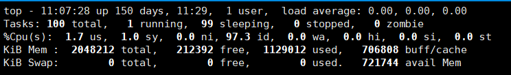

# Linux

## 目录结构

- **/bin** 供所有用户使用的基本命令 如：ls, cd 等
- **/sbin** 超级用户使用的可执行文件，里面多是系统管理命令
- **/etc** 系统和应用软件的配置文件 
- **/proc** 虚拟文件系统，存放系统信息（cpu、操作系统版本），进程信息
- 

- **/usr** 应用程序目录，类似windows的promgram files

参考资料：<https://juejin.im/post/5aaf1975f265da239d4918b9>

# centos

- 通过xshell上传下载文件

  ```shell
  yum install lrzsz -y
  ```

- rpm（red hat pakage manage）安装包安装

  ```shell
  rpm -ivh **.rmp
  ```

- 查看内核版本等信息

  ```shell
  uname
  ```

- 升级软件以及内核

  ```
  yum update
  ```

  


# Ubuntu


## MySQL相关

- 查看是否安装了某软件

  rpm -qa | grep -i mysql

-  查看mysql是否正在运行

  ps -ef | grep mysql

- 设置开机自动启动mysql

  ```shell
  # 设置开机启动方法一
  chkconfig mysql on
  # 查看结果
  chkconfig --list | grep mysql
  ```

  ```shell
  # 方法二 图形界面
  yum install ntsysv
  ntsysv
  ```

- 相关文件位置

  - /var/lib/mysql/ 数据库文件
  - /usr/share/mysql 配置文件目录
  - /usr/bin 相关命令目录
  - /etc/init.d/mysql 启动停止相关脚本


# 用户和用户组管理

- useradd -m [用户名] 添加用户

- passwd [用户名] 修改密码

- userdel

  ```shell
  # -r 删除用户主目录
  userdel -r [用户名]
  ```

- 


# Redis安装

- 没有gcc需要先安装gcc

- 如果第一次make失败，第二次make报错

  ```shell
  Jemalloc/jemalloc.h：没有那个文件或者目录
  ```

  解决：运行make distclean 之后再make  


# 常用命令

- netstat 需要好好理解，可以理解tcp握手原理


# 网络配置相关命令

- ip addr


# Docker

## centos7

```shell
# 安装（貌似对linux内核版本有要求）
yum install docker

# 启动
systemctl start docker

# 查看docker版本,检查是否安装成功
docker -v

# 将docker服务设置为开机启动
systemctl enable docker


```


# top



第一行：

- 当前时间
- 系统已运行的时间
- 当前登录用户的数量
- 相应最近5、10和15分钟内的平均负载。

第二行：

不同状态进程的数目

running、sleeping、stopped、zombie（僵尸进程）

第三行：cpu状态，显示了不同模式下的所占CPU时间的百分比

- us, user： 运行(未调整优先级的) 用户进程的CPU时间
- sy，system: 运行内核进程的CPU时间
- ni，niced：运行已调整优先级的用户进程的CPU时间
- wa，IO wait: 用于等待IO完成的CPU时间
- hi：处理硬件中断的CPU时间
- si: 处理软件中断的CPU时间
- st：这个虚拟机被hypervisor偷去的CPU时间（译注：如果当前处于一个hypervisor下的vm，实际上hypervisor也是要消耗一部分CPU处理时间的）。


对于每一个进程

**USER**

进程所有者的实际用户名。

**PR**

进程的调度优先级。这个字段的一些值是'rt'。这意味这这些进程运行在实时态。

**NI**

进程的nice值（优先级）。越小的值意味着越高的优先级。

**VIRT**

进程使用的虚拟内存。

**RES**

驻留内存大小。驻留内存是任务使用的非交换物理内存大小。

**SHR**

SHR是进程使用的共享内存。

**S**

这个是进程的状态。它有以下不同的值:

- D - 不可中断的睡眠态。
- R – 运行态
- S – 睡眠态
- T – 被跟踪或已停止
- Z – 僵尸态

**%CPU**

自从上一次更新时到现在任务所使用的CPU时间百分比。

**%MEM**

进程使用的可用物理内存百分比。

**TIME+**

任务启动后到现在所使用的全部CPU时间，精确到百分之一秒。

**COMMAND**

运行进程所使用的命令。


# netstat

- **-a** 列出 tcp, udp 和 unix 协议下所有套接字的所有连接

```shell
netstat -a
```

- **-t / -u** 只列出 TCP 或 UDP 协议的连接

```shell
netstat -at  # tcp
netstat -au  # 列出 UDP 协议的连接
```

- **-n** 选项禁用域名解析功能。

```shell
# 默认情况下 netstat 会通过反向域名解析技术查找每个 IP 地址对应的主机名。
```

- **-l** 选项列出正在监听的套接字。

- **-p** 选项查看进程信息

- **-ep** 选项可以同时查看进程名和用户名

- **-s** 选项 打印统计信息

- **-r** 选项打印内核路由信息。打印出来的信息与 route 命令输出的信息一样。我们也可以使用 **-n** 选项禁止域名解析。

- **-i** 选项 打印网络接口信息

  ```shell
  #  -e 选项和 -i 选项搭配使用
  netstat -ie
  ```

- **-c** 选项持续输出信息


> 应用：
>
> 1. 查看已经建立的tcp连接
>
>    netstat -atnp | grep ESTA
>
> 2. 查看服务是否在运行
>
>    netstat -apl | grep mysql  # -a 全部  -p显示进程信息  -l 显示listening的连接


# 参考资料

- 常用命令https://juejin.im/entry/5d1350a5f265da1b8a4f2dcd