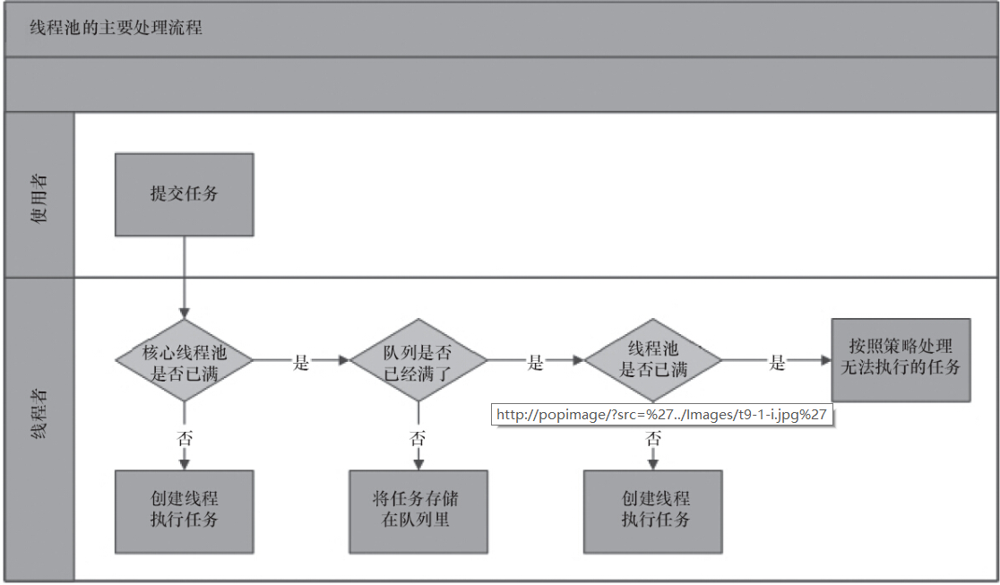
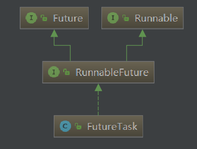

# Java中的锁

## sychronized

- 对于同步方法，JVM采用`ACC_SYNCHRONIZED`标记符来实现同步。 对于同步代码块。JVM采用`monitorenter`、`monitorexit`两个指令来实现同步。
- 解决并发中的问题：
  - 原子性：
  - 可见性：解锁操作 happen-before 加锁操作
  - 有序性：同步块只能单线程运行，在一个线程中重排序会遵循as-if-serial，保证了有序性


## ReentrantLock

一、 内存可见性

跟synchronized一样遵循内存可见性：对锁的解锁 Happens-Before 于后续对这个锁的加锁

二、实现

使用ASQ（同步器）实现

三、使用

> 1. 在finally块中释放锁，保证在获取到锁之后，最终能被释放
>
> 2. 不要将获取锁的过程写在try块中，因为如果在获取锁（自定义锁的实现）发生了异常，异常抛出的同时，也会导致锁无故释放

```java
lock.lock();
try {
    // 操作
} finally {
    lock.unlock();
}
```

## 相同

都是可重入锁

## 区别

**1. 锁的实现**

synchronized 是 JVM 实现的，而 ReentrantLock 是 JDK 实现的。

**2. 性能**

新版本 Java 对 synchronized 进行了很多优化，例如自旋锁等，synchronized 与 ReentrantLock 大致相同。

**3. 等待可中断**

当持有锁的线程长期不释放锁的时候，正在等待的线程可以选择放弃等待，改为处理其他事情。

ReentrantLock 可中断，而 synchronized 不行。

**4. 公平锁**

公平锁是指多个线程在等待同一个锁时，必须按照申请锁的时间顺序来依次获得锁。

synchronized 中的锁是非公平的，ReentrantLock 默认情况下也是非公平的，但是也可以是公平的。

**5. 锁绑定多个条件**

一个 ReentrantLock 可以同时绑定多个 Condition 对象。

## 用锁的最佳实践

首先你的代码是否会被多线程调用？

否：无需加锁

有：参考如下原则：

1. 永远只在**更新对象的成员变量**时加锁

2. 永远只在**访问可变的成员变量**时加锁

   > 解释：在一些场景，对一致性要求不高，读成员变量可以不加锁

3. 永远不在调用其它对象的方法时加锁，因为调用其它对象的方法是不安全的（对其它对象的方法不了解）

   - 可能有Thread.sleep()，也有可能有慢IO，这会**严重影响性能**
   - 甚至还会加锁，这有可能导致**死锁**

4. 减少锁的**持有时间**

5. 减少**锁粒度**


# 线程之间的协作

## wait、notify


## join()的实现

**底层实现：使用了wait、notify机制**

```java
public final synchronized void join(long millis)
    throws InterruptedException {
        long base = System.currentTimeMillis();
        long now = 0;

        if (millis < 0) {
            throw new IllegalArgumentException("timeout value is negative");
        }

        if (millis == 0) {
            while (isAlive()) {
                wait(0);		// 永久等待
            }
        } else {
            while (isAlive()) { // 循环判断线程是否存活
                long delay = millis - now;
                if (delay <= 0) {
                    break;
                }
                wait(delay);	// 超时等待
                now = System.currentTimeMillis() - base;
            }
        }
    }
```


# J.U.C - CAS

Compare And Swap

硬件提供的支持

使用cas一般配合自旋使用，这样在并发中，去除了锁的相关操作，提高了性能


# J.U.C - LockSupport

## 简介

LockSupprot是线程的阻塞原语，用来阻塞线程和唤醒线程。每个使用LockSupport的线程都会与一个许可关联，如果该许可可用，并且可在线程中使用，则调用park()将会立即返回，否则可能阻塞。如果许可尚不可用，则可以调用 unpark 使其可用。但是注意许可**不可重入**，也就是说只能调用一次park()方法，否则会一直阻塞。


## api

主要有两个方法：

- park() 阻塞当前线程（不调度该线程）

  > 如果调用unpark方法或者当前线程被中断，能从park()方法中返回

- unpark(Thread thread) 

  > （1）如果thread在part上阻塞，那么将会解除阻塞。
  >
  > （2）先执行unpark() , 接着执行park()，线程不会阻塞


> 注意：park() 和 park(Object blocker)的区别
>
> 使用park(Object blocker)可以在打印线程堆栈的时候，看到线程阻塞相关联的对象blocker


## 例子

先进先出非重入锁类

```java
class FIFOMutex {
   private final AtomicBoolean locked = new AtomicBoolean(false);
   private final Queue<Thread> waiters
     = new ConcurrentLinkedQueue<Thread>();

   public void lock() {
     boolean wasInterrupted = false;
     Thread current = Thread.currentThread();
     waiters.add(current);

     // Block while not first in queue or cannot acquire lock
     while (waiters.peek() != current ||
            !locked.compareAndSet(false, true)) {
       LockSupport.park(this);
       if (Thread.interrupted()) // ignore interrupts while waiting
         wasInterrupted = true;
     }

     waiters.remove();
     if (wasInterrupted)          // reassert interrupt status on exit
       current.interrupt();
   }

   public void unlock() {
     locked.set(false);
     LockSupport.unpark(waiters.peek());// 唤醒等待队列中的首个元素
   }
}
```


# J.U.C - AQS（队列同步器）

简介：

AQS的实现主要在于维护一个volatile int state（代表共享资源）和一个FIFO线程等待队列（多线程争用资源被阻塞时会进入此队列）

<https://juejin.im/post/5aeb07ab6fb9a07ac36350c8>


# J.U.C  并发容器

## List（CopyOnWriteArrayList）

### 一、原理

- 共享变量

```java
private transient volatile Object[] array;
```

- 对所有的读操作不加锁

  对所有的写操作（add、set、remove）：

  1）先加锁

  2）使用Arrays.copyOf()复制一份新数组newElements，在新数组进行写操作

  3）更改原数组setArray(newElements);

  4）释放锁

### 二、注意

CopyOnWriteArrayList仅适用于写操作非常少的场景，而且能够容忍读写的短暂不一致。

CopyOnWriteArrayList迭代器是只读的，不支持增删改。因为迭代器遍历的仅仅是一个快照，而对快照进行增删改是没有意义的。


##Map

ConcurrentHashMap

ConcurrentSkipListMap


## Set

Set接口的两个实现是CopyOnWriteArraySet和ConcurrentSkipListSet，使用场景可以参考前面讲述的CopyOnWriteArrayList和ConcurrentSkipListMap，


## Queue

分类

- 阻塞：阻塞指的是当队列已满时，入队操作阻塞；当队列已空时，出队操作阻塞
- 非阻塞
- 单端：单端指的是只能队尾入队，队首出队
- 双端：队首队尾皆可入队出队

> 阻塞队列都用Blocking关键字标识，单端队列使用Queue标识，双端队列使用Deque标识。


#J.U.C  并发工具

## Semaphore(信号量)

### 一、信号量模型

组成：

- 一个计数器
- 一个等待队列
- 三个方法
  - init 设置计数器初始值
  - up  计数器的值加1；如果此时计数器的值小于或者等于0，则唤醒等待队列中的一个线程，并将其从等待队列中移除。
  - down 计数器的值减1；如果此时计数器的值小于0，则当前线程将被阻塞，否则当前线程可以继续执行。

> 信号量是由大名鼎鼎的计算机科学家迪杰斯特拉（Dijkstra）于1965年提出，在这之后的15年，信号量一直都是并发编程领域的终结者，直到1980年管程被提出来，我们才有了第二选择。
>
> down()、up()这两个操作历史上最早称为P操作和V操作，所以信号量模型也被称为PV原语。


### 二、例子

```java
static int count;
//初始化信号量
static final Semaphore s = new Semaphore(1);
//用信号量保证互斥    
static void addOne() {
    s.acquire();
  	try {
    	count+=1;
  	} finally {
    	s.release();
  	}
}
```

### 三、信号量与管程

信号量可以实现的独特功能就是同时允许多个线程进入临界区

信号量不能做的就是同时唤醒多个线程去争抢锁，只能唤醒一个阻塞中的线程


> 信号量（semaphore）和管程（monitor）可以解决所有的并发问题。
>
> 那Java SDK并发包里为什么还有很多其他的工具类呢？
>
> 原因很简单：**分场景优化性能，提升易用性**。


## ReadWriteLock(读写锁)

### 一、使用场景：

读多写少的并发场景

>  与互斥锁的比较:
>
> 互斥锁，读与读之间也是互斥的，因此在读多写少的场景下，读写锁相比互斥锁性能更高


### 二、是什么？

读写锁不是Java独有的，通用概念如下

1. 允许多个线程同时读共享变量；
2. 只允许一个线程写共享变量；
3. 如果一个写线程正在执行写操作，禁止其他线程的读和写


### 三、应用：实现缓存

```java
class Cache<K,V> {
	final Map<K, V> m = new HashMap<>();
  	final ReadWriteLock rwl = new ReentrantReadWriteLock();
  	// 读锁
  	final Lock r = rwl.readLock();
  	// 写锁
  	final Lock w = rwl.writeLock();
  	// 读缓存
  	V get(K key) {
    	r.lock();
    	try { return m.get(key); }
    	finally { r.unlock(); }
  	}
  	// 写缓存
  	V put(String key, Data v) {
    	w.lock();
    	try { return m.put(key, v); }
    	finally { w.unlock(); }
  	}
}
```

上面的代码假如有下面的场景：

从缓存中get不到时会去查数据库，然后将结果set到缓存中，伪代码如下

```java
value = cache.get()
if(value == null){   
	value // 查数据库得到value
	cache.set(value);
}
```

如果同时T1，T2，T3执行上述代码，都会去查数据库（重复操作）

**改进get方法如下（使用双重检查机制）**

```java
class Cache<K,V> {
  final Map<K, V> m =
    new HashMap<>();
  final ReadWriteLock rwl = 
    new ReentrantReadWriteLock();
  final Lock r = rwl.readLock();
  final Lock w = rwl.writeLock();
 
  V get(K key) {
    V v = null;
    //读缓存
    r.lock();         ①
    try {
      v = m.get(key); ②
    } finally{
      r.unlock();     ③
    }
    //缓存中存在，返回
    if(v != null) {   ④
      return v;
    }  
    //缓存中不存在，查询数据库
    w.lock();         ⑤
    try {
      //再次验证，其他线程可能已经查询过数据库
      v = m.get(key); ⑥// 同一个线程获取同一把锁，可重入锁
      if(v == null){  ⑦
        v=省略代码无数 //查询数据库
        m.put(key, v);
      }
    } finally{
      w.unlock();
    }
    return v; 
  }
}
```


## StampedLock

支持乐观读、在读多写少的场景并发效率更好

StampedLock在读的时候不加锁，而ReadWriteLock在读的时候会加读锁，因此StampedLock效率更高


## CountDownLatch

### 一、是什么

J.U.C提供的同步工具，可以让一个或多个线程等待 **直到一系列操作完成之后**再执行

> happen-before:
>
> 一个线程调用countDown()方法happen-before，另一个线程调用await()方法
>
> 看源码可以发现这条规则对应volatile变量的happen-before原则

### 二、使用

```java
CountDownLatch latch = new CountDownLatch(N);// 初始化计数器为N

latch.countDown(); // 调用一次计数器减1

latch.await();		// 一直阻塞直到计数器为0被唤醒
```

JDK中提供的例子：

1. CountDownLatch初始化为1，可以让多个线程await，相当于一个开关，一运行countDown，所有线程开始执行（比如代码中的start的变量）
2. CountDownLatch初始化为N，可以让一个线程，等待其他N个操作完成再执行（比如代码中的end变量）

```java
/**
 * @Author: chensb
 * @Date: 2019/8/8 8:58
 */
public class CountDwonLatchDemo {
    public static void main(String[] args) throws InterruptedException {
        int n = 10; // 线程数目
        CountDownLatch start = new CountDownLatch(1);
        CountDownLatch end = new CountDownLatch(n);

        for(int i=0;i<n;++i){
            new Thread(new Worker(i, start, end), "t"+i).start();
        }

        System.out.println("main --- 同一时间启动所有任务");
        start.countDown(); // 让所有线程运行
        end.await();		// 等待所有线程执行完毕
        System.out.println("main --- 所有线程执行完毕");
    }
}
class Worker implements Runnable{
    private final CountDownLatch start;// final修饰
    private final CountDownLatch end;	// final修饰
    private int taskNumber;

    public Worker(int tackNumber, CountDownLatch latchStart, CountDownLatch latchEnd){
        this.taskNumber = tackNumber;
        this.start = latchStart;
        this.end = latchEnd;
    }

    @Override
    public void run() {
        try {
            start.await();
            doWork();
        } catch (InterruptedException e) {
            e.printStackTrace();
        } finally {
            end.countDown();  // 在finally块中执行，
        }
    }

    private void doWork(){
        System.out.println(Thread.currentThread().getName() + "do task " + taskNumber);
    }
}
```


### 三、与join的比较

- join底层实现是wait、notify机制，功能简单，只能**等待多个线程**执行完毕
- CountDownLatch底层实现是AQS，能等待多个**操作**执行完毕，不一定需要等待线程执行完毕


## CyclicBarrier(循环屏障)

### 一、是什么：

- 可以让一组线程到达一个屏障时被阻塞，直到最后一个线程到达屏障，屏障才会开门，所有被拦截的线程才会继续执行
- 线程调用 `barrier.await()` 来将计数器减1，同时等待计数器变为0
- 自动重置计数器，当减到0的时候，会自动重置计数器为初始值

- 构造函数可以传入一个Runnable变量：

```java
// barrierAction会在所有线程都到达屏障之后执行，这时再打开屏障，然后所有线程继续执行
CyclicBarrier(int parties, Runnable barrierAction)
```


## 原子类

使用cas实现


#J.U.C  线程池 

## ThreadPoolExecutor

### 一、使用

```java
ThreadPoolExecutor(
  int corePoolSize,
  int maximumPoolSize,
  long keepAliveTime,
  TimeUnit unit,
  BlockingQueue<Runnable> workQueue,
  ThreadFactory threadFactory,
  RejectedExecutionHandler handler) 
```

- **corePoolSize**：表示线程池保有的最小线程数。

- **maximumPoolSize**：表示线程池创建的最大线程数。当项目很忙时，就需要加人，但是也不能无限制地加，最多就加到maximumPoolSize个人。当项目闲下来时，就要撤人了，最多能撤到corePoolSize个人。

- **keepAliveTime & unit**：如果一个线程空闲了`keepAliveTime & unit`这么久，而且线程池的线程数大于 corePoolSize ，那么这个空闲的线程就要被回收了。

- **workQueue**：任务队列，存放提交给线程池的任务，当线程数>=corePoolSize时，将提交的任务放入队列

  > 使用LinkedBlockingQueue创建阻塞队列，一般需要设置大小（有界队列）
  >
  > ```java
  > // 如果不指定大小，默认为Integer.MAX_VALUE
  > public LinkedBlockingQueue() {
  >     this(Integer.MAX_VALUE);
  > }
  > ```

- **threadFactory**：通过这个参数你可以自定义如何创建线程，例如你可以给线程指定一个有意义的名字。

- **handler**

  ：通过这个参数你可以自定义任务的拒绝策略。如果线程池中所有的线程都在忙碌，并且工作队列也满了（前提是工作队列是有界队列），那么此时提交任务，线程池就会拒绝接收。至于拒绝的策略，你可以通过handler这个参数来指定。ThreadPoolExecutor已经提供了以下4种策略。

  - CallerRunsPolicy：提交任务的线程自己去执行该任务。
  - AbortPolicy：默认的拒绝策略，会throws RejectedExecutionException。
  - DiscardPolicy：直接丢弃任务，没有任何异常抛出。
  - DiscardOldestPolicy：丢弃最老的任务，其实就是把最早进入工作队列的任务丢弃，然后把新任务加入到工作队列。

Java在1.6版本还增加了 allowCoreThreadTimeOut(boolean value) 方法，它可以让所有线程都支持超时，这意味着如果项目很闲，就会将项目组的成员都撤走。




## FutureTask

### 一、是什么

直接看FutureTask提供的api

- 用来获取任务的执行结果（该方式会发生阻塞直到任务执行完毕）

- 取消任务的执行

```java
// 取消任务
boolean cancel(boolean mayInterruptIfRunning);
// 判断任务是否已取消  
boolean isCancelled();
// 判断任务是否已结束
boolean isDone();
// 获得任务执行结果
get();
// 获得任务执行结果，支持超时
get(long timeout, TimeUnit unit);
```

### 二、应用

用来获取异步任务的执行结果


### 三、原理



**FutureTask成员变量**

```java
// 用来标记任务状态
private volatile int state;
// 可取的值
private static final int NEW          = 0;
private static final int COMPLETING   = 1;
private static final int NORMAL       = 2;
private static final int EXCEPTIONAL  = 3;
private static final int CANCELLED    = 4;
private static final int INTERRUPTING = 5;
private static final int INTERRUPTED  = 6;

/** The underlying callable; nulled out after running */
private Callable<V> callable;
/** The result to return or exception to throw from get() */
private Object outcome; // non-volatile, protected by state reads/writes
/** The thread running the callable; CASed during run() */
private volatile Thread runner;
/** Treiber stack of waiting threads */
private volatile WaitNode waiters;
```

**FutureTask方法**

jdk1.6使用AQS实现

jdk8使用 Treiber stack(FutureTask 中的 waiters成员变量)  + LockSupport实现

Treiber stack : 使用cas实现一个无锁的并发栈，[示例代码](https://en.wikipedia.org/wiki/Treiber_stack)

>  主要思路:
>
> （1）调用get方法时，如果任务未完成，加入waiters中，调用LockSupport.park()阻塞线程
>
> （2）任务执行完毕之后，遍历所有等待线程，调用LockSupport.unpark()唤醒线程


