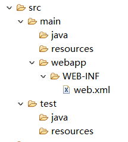
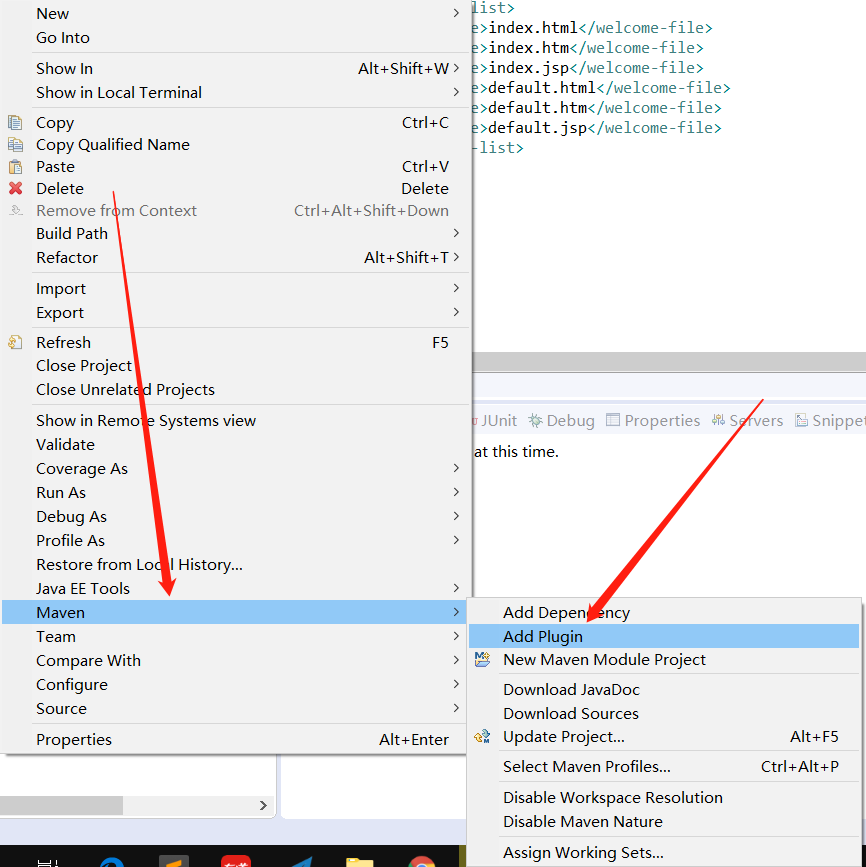
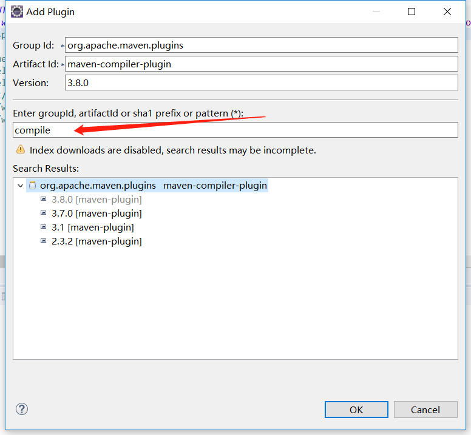
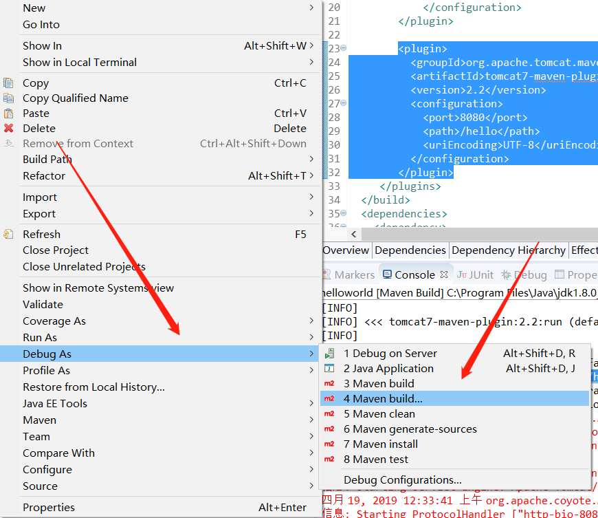

# 安装

1. 下载安装包

2. 配置环境变量MAVEN_HOME
3. 修改系统环境变量PATH，加入%MAVEN_HOME%/bin;

*注意：由于maven是使用Java开发的，因此其运行需要jre，因此必须安装jdk，然后配置环境变量JAVA_HOME*

4. 测试：在cmd中输入mvn -v查看maven版本


# Maven工程目录



- src/main/java  项目源代码
- src/main/resources 项目资源文件，比如Spring配置文件
- src/main/webapp   web项目必备


# maven命令

- mvn compile 编译src/main中的源文件，输出到target目录下
- mvn clean 清除target目录
- mvn test 编译src/main中的源文件，编译src/test中的测试类并运行单元测试
- mvn pakage 将项目打包
- mvn install 将项目打包并发布到本地仓库


# 修改JDK版本

新建maven项目后默认是jre1.5

解决办法：

1. 添加插件，修改pom.xml

   - 步骤1

   

   - 步骤2

   

   - 步骤三，在pom.xml中添加jdk版本信息

   ```xml
   <plugin>
       <groupId>org.apache.maven.plugins</groupId>
       <artifactId>maven-compiler-plugin</artifactId>
       <version>3.8.0</version>
       <configuration>
           <!-- 源码版本 -->
           <source>1.8</source>
           <!-- 编译目标版本 -->
           <target>1.8</target>
           <!-- 指定编码 -->
           <encoding>utf-8</encoding>
       </configuration>
   </plugin>
   ```

2. 配置完之后可能工程还是jre1.5，这时只需要maven update一下即可


# 依赖的作用范围

通过<scope></scope>标签配置

eg:

```xml
<dependency>
    <groupId>javax.servlet</groupId>
    <artifactId>javax.servlet-api</artifactId>
    <version>3.1.0</version>
    <scope>provided</scope>
</dependency>
<dependency>
    <groupId>javax.servlet.jsp</groupId>
    <artifactId>jsp-api</artifactId>
    <version>2.1</version>
    <scope>provided</scope>
</dependency>
```

取值：

- compile  依赖会用在编译，测试，运行

- provided 依赖只有在当JDK或者一个容器已经提供该依赖时使用。provided依赖在编译和测试时需要，在运行时不需要，比如servlet api ，tomcat容器已经提供该jar包

- runtime 依赖在运行和测试系统时候需要，但在编译的时候不需要。比如：jdbc的驱动包

- test 依赖在编译和运行的时候都不需要，只有在测试编译和测试运行阶段可用，比如junit

  

# 使用Maven tomcat 插件运行项目

> **配置插件**

```xml
<plugin>
    <groupId>org.apache.tomcat.maven</groupId>
    <artifactId>tomcat7-maven-plugin</artifactId>
    <version>2.2</version>
    <configuration>
    <port>8080</port>
    <path>/hello</path>
    <uriEncoding>UTF-8</uriEncoding>
    </configuration>
</plugin>
```

> **右键点击项目**



> **运行命令**


参考：http://my.oschina.net/lilw/blog/168667

