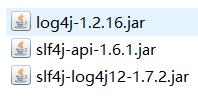
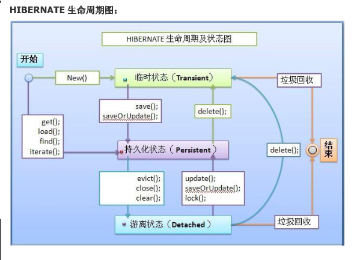

# Hibernate

[TOC]


## 是什么

- Hibernate是一种ORM(Object Relational Mapping ）框架
- 它对JDBC进行了非常轻量级的对象封装 
- hibernate可以自动生成SQL语句，自动执行，使得Java程序员可以随心所欲的使用对象编程思维来操纵数据库 


## 为什么要用

- 传统基于JDBC的开发，代码重复性过多
- 使用Hibernate框架，简化了Dao层的编码工作，不用我们写很多繁琐的SQL语句


## 快速上手

注意：此案例基于hibernate-release-5.0.7.Final

1. **下载Hibernate 开发环境，解压后有三个主要文件夹**

   - documentation          :Hibernate开发的文档
   - lib                                  :Hibernate开发包
     - required               		:Hibernate开发的必须的依赖
     - optional                         :Hibernate开发的可选的jar包
   - project                          :Hibernate提供的项目

2. **创建一个项目，引入jar包**

   - 数据库驱动包  mysql-connector-java-5.1.7-bin.jar

   - Hibernate开发的必须的jar包。  步骤1中required中所有的包

   - 日志记录包

3. **创建表**

   ```sql
   CREATE TABLE `cst_customer` (
     `cust_id` bigint(32) NOT NULL AUTO_INCREMENT COMMENT '客户编号(主键)',
     `cust_name` varchar(32) NOT NULL COMMENT '客户名称(公司名称)',
     `cust_source` varchar(32) DEFAULT NULL COMMENT '客户信息来源',
     `cust_industry` varchar(32) DEFAULT NULL COMMENT '客户所属行业',
     `cust_level` varchar(32) DEFAULT NULL COMMENT '客户级别',
     `cust_phone` varchar(64) DEFAULT NULL COMMENT '固定电话',
     `cust_mobile` varchar(16) DEFAULT NULL COMMENT '移动电话',
     PRIMARY KEY (`cust_id`)
   ) ENGINE=InnoDB AUTO_INCREMENT=1 DEFAULT CHARSET=utf8; 
   ```

4. **创建实体类**

   com.example.hibernate.demo1.Customer.java

   ```java
   public class Customer {
   	private Long cust_id;
   	private String cust_name;
   	private String cust_source;
   	private String cust_industry;
   	private String cust_level;
   	private String cust_phone;
   	private String cust_mobile;
   	// 省略getter setter
   }
   ```

5. **创建实体类Customer 与表cst_customer的映射**

   src/com/example/hibernate/demo1/Customer.hbm.xml

   命名格式一般为：类名.hbm.xml

   ```xml
   <?xml version="1.0" encoding="UTF-8"?>
   <!DOCTYPE hibernate-mapping PUBLIC 
       "-//Hibernate/Hibernate Mapping DTD 3.0//EN"
       "http://www.hibernate.org/dtd/hibernate-mapping-3.0.dtd">
   <hibernate-mapping>
   	<!-- 建立类与表的映射 -->
   	<class name="com.example.hibernate.demo1.Customer" table="cst_customer">
   		<!-- 建立类中的属性与表中的主键对应 -->
   		<id name="cust_id" column="cust_id" >
   			<generator class="native"/>
   		</id>
   		
   		<!-- 建立类中的普通的属性和表的字段的对应 -->
   		<property name="cust_name" column="cust_name" length="32" />
   		<property name="cust_source" column="cust_source" length="32"/>
   		<property name="cust_industry" column="cust_industry"/>
   		<property name="cust_level" column="cust_level"/>
   		<property name="cust_phone" column="cust_phone"/>
   		<property name="cust_mobile" column="cust_mobile"/>
   	</class>
   </hibernate-mapping>
   ```

   *注意：*

   *(1)该配置文件的DTD 在hibernate-core-5.0.7.Final.jar包下的/org/hibernate/hibernate-mapping-3.0.dtd*

   *(2)在eclipse中设置xml自动提示，需要告诉eclipse相应的DTD文件位置具体设置可以自行百度*

6. **创建Hibernate的核心配置文件**

   - Hibernate的核心配置文件的名称：hibernate.cfg.xml
   - 放置在src目录下
   - 该配置文件的DTD 在hibernate-core-5.0.7.Final.jar包下的/org/hibernate/hibernate-configuration-3.0.dtd
   - 具体怎么写可以参考步骤1中project文件夹下的/etc/hibernate.properties

   ```xml
   <?xml version="1.0" encoding="UTF-8"?>
   <!DOCTYPE hibernate-configuration PUBLIC
   	"-//Hibernate/Hibernate Configuration DTD 3.0//EN"
   	"http://www.hibernate.org/dtd/hibernate-configuration-3.0.dtd">
   <hibernate-configuration>
   	<session-factory>
   		<!-- 连接数据库的基本参数 -->
   		<property name="hibernate.connection.driver_class">com.mysql.jdbc.Driver</property>
   		<property name="hibernate.connection.url">jdbc:mysql:///hibernate</property>
   		<property name="hibernate.connection.username">root</property>
   		<property name="hibernate.connection.password">123456</property>
   		<!-- 配置Hibernate的方言 -->
   		<property name="hibernate.dialect">org.hibernate.dialect.MySQLDialect</property>
   		
   		<!-- 可选配置================ -->
   		<!-- 打印SQL -->
   		<property name="hibernate.show_sql">true</property>
   		<!-- 格式化SQL ，使得打印出来的SQL语句更加美观-->
   		<property name="hibernate.format_sql">true</property>
   		
            <!-- 映射文件 -->
   		<mapping resource="com/example/hibernate/demo1/Customer.hbm.xml"/>
   	</session-factory>
   </hibernate-configuration>
   ```

7. **编写测试代码**

   ```java
   public class Example {
   
   	@Test
   	// 保存客户的案例
   	public void test(){
   		// 1.加载Hibernate的核心配置文件
   		Configuration configuration = new Configuration().configure();
   		// 手动加载映射
   		// configuration.addResource("com/example/hibernate/demo1/Customer.hbm.xml");
   		// 2.创建一个SessionFactory对象：类似于JDBC中连接池 	
   		SessionFactory sessionFactory = configuration.buildSessionFactory();
   		// 3.通过SessionFactory获取到Session对象：类似于JDBC中Connection
   		Session session = sessionFactory.openSession();
   		// 4.手动开启事务：
   		Transaction transaction = session.beginTransaction();
   		// 5.编写代码
   		
   		Customer customer = new Customer();
   		customer.setCust_name("王西");
   		
   		session.save(customer);
   		
   		// 6.事务提交
   		transaction.commit();
   		// 7.资源释放
   		session.close();
   		sessionFactory.close();
   	}
   }
   ```


## 映射的配置

- 【class标签的配置】建立类与表的映射关系

  属性：

  - name                ：类的全路径
  - table                 ：表名（类名与表名一致，table可以省略）
  - catalog              ：数据库名

- 【id标签的配置】类中的属性与表中的主键的对应关系

  属性：

  - name                ：类中的属性名
  - column             ：表中的字段名（类中的属性名和表中的字段名如果一致，column可以省略）
  - length               ：长度
  -  type                  ：类型

- 【property标签的配置】类中的普通属性与表的字段的对应关系

   属性：

  - name                ：类中的属性名
  - column              ：表中的字段名
  - length               ：长度
  - type                   ：类型
  - not-null             ：设置非空
  - unique              ：设置唯一


## 核心配置

```
// 加载Hibernate的核心配置文件
Configuration configuration = new Configuration().configure();
// 该语句默认会到src/hibernate.cfg.xml加载核心配置文件  
```

- 必须的配置

  - 连接数据库的基本的参数
    - 驱动类
    - url路径
    - 用户名 
    - 密码
    - 方言

- 可选的配置

  - 显示SQL         ：hibernate.show_sql
  - 格式化SQL     ：hibernate.format_sql
  - 自动建表        ：hibernate.hbm2ddl.auto
    - none                 ：不使用hibernate的自动建表
    - create               ：如果数据库中已经有表，**删除原有表**，重新创建，如果没有表，新建表。（测试）
    - create-drop     ：如果数据库中已经有表，**删除原有表，执行操作，删除这个表**。如果没有表，新建一个，使用完了删除该表。（测试）
    - update             ：如果数据库中有表，使用原有表，如果没有表，创建新表（**更新表结构**）
    - validate            ：如果没有表，不会创建表。只会使用数据库中原有的表。（校验映射和表结构）。

- 映射文件的引入     

  引入映射文件的位置

  ```xml
  <mapping resource="com/example/hibernate/demo1/Customer.hbm.xml"/>
  ```

- 例子：

  ```xml
  <?xml version="1.0" encoding="UTF-8"?>
  <!DOCTYPE hibernate-configuration PUBLIC
  	"-//Hibernate/Hibernate Configuration DTD 3.0//EN"
  	"http://www.hibernate.org/dtd/hibernate-configuration-3.0.dtd">
  <hibernate-configuration>
  	<session-factory>
  		<!-- 连接数据库的基本参数 -->
  		<property name="hibernate.connection.driver_class">com.mysql.jdbc.Driver</property>
  		<property name="hibernate.connection.url">jdbc:mysql:///hibernate</property>
  		<property name="hibernate.connection.username">root</property>
  		<property name="hibernate.connection.password">123456</property>
  		<!-- 配置Hibernate的方言 -->
  		<property name="hibernate.dialect">org.hibernate.dialect.MySQLDialect</property>
  		
  		<!-- 可选配置================ -->
  		<!-- 打印SQL -->
  		<property name="hibernate.show_sql">true</property>
  		<!-- 格式化SQL ，使得打印出来的SQL语句更加美观-->
  		<property name="hibernate.format_sql">true</property>
           <property name="hibernate.format_sql">true</property>
  		
           <!-- 自动创建表 -->
  		<property name="hibernate.hbm2ddl.auto">update</property>
          
          
           <!-- 映射文件 -->
  		<mapping resource="com/example/hibernate/demo1/Customer.hbm.xml"/>
  	</session-factory>
  </hibernate-configuration>
  ```

  

## 常用API

- Configuration

  - 用来加载配置文件

- SessionFactory

  - 用来创建Session
  - 内部维护连接池
  - 比较重量级，一般一个应用只创建一个对象
  - 线程安全

- Session

  - 与数据库进行交互
  - 线程不安全

- Transaction

  ​	事务commit()  rollback()


## 主键生成策略

- 主键的分类

  - 自然主键：主键本身就是表中的一个字段

    eg:学生表中，学号就是自然属性

  - 代理主键：不是表的字段，比如设置一个自增长的id字段

    **尽量使用代理主键**

- **hibernate主键生成策略**

  - **increment** :hibernate中提供的自动增长机制
    - 实现原理，首先发送一条语句select max(id) from 表，然后以id+1作为下一条记录的主键
    - 线程不安全，原因见实现原理
  - **indentity** 使用数据库底层的自动增长机制
    - *Oracle不支持自动增长机制*
  - **sequence** 采用序列的方式
    - *Oracle支持，但MySQL不支持*
  - **uuid** 适用于字符串类型的主键
    - *与上述三种进行区分，上述increment ，indentity ，sequence适用于short,int,long类型的主键*
  - **native** 会根据底层数据库自动选择identity 或者 sequence
  - **assigened** 该生成策略的主键值来自程序员手工设置，即通过setId()方法设置。属性类型可以是String、Int，但一般为String。此生成策略用于业务相关主键。例如学号、身份证号做主键


## 持久化类的三种状态

- 瞬时态（transient）没有唯一的标识OID,没有被session管理
- 持久态（persister）有唯一标识OID,被session管理
- 托管态（detached）有唯一标识OID,没有被session管理

```java
public class Demo1 {
	@Test
	public void demo() {
		Session session = HibernateUtil.openSession();// 自定义工具类
		Transaction transaction = session.beginTransaction();
		
		Customer customer = new Customer();	// 瞬时态对象
		customer.setCust_name("小明");
		
		session.save(customer); // 持久态对象 
		customer.setCust_mobile("110"); // 持久态对象，对customer的更改会同时更改数据库
		
		transaction.commit();
		session.close();
		
		System.out.println(customer); // 脱管态对象 
	}
}	
```




## 一级缓存

- 为了减少与数据库交互的次数，session内部维护了一个缓存

- 所有对javabean的更改，不会立即发送sql语句到数据库，而是先更改一级缓存

- 跟session一样的生命周期

  ----------

## 事务

- ### 事务的四个特性 

  - **原子性（Atomicity）**：事务作为一个整体被执行，包含在其中的对数据库的操作要么全部被执行，要么都不执行。

  - **一致性（Consistency）**：保证事务只能把数据库从一个有效（正确）的状态“转移”到另一个有效（正确）的状态 

    >*那么，什么是数据库的有效(正确）的状态？满足给这个数据库pred-defined的一些规则的状态都是 valid 的。这些规则有哪些呢，比如说constraints, cascade,triggers及它们的组合等。具体到某个表的某个字段，比如你在定义表的时候，给这个字段的类型是number类型，并且它的值不能小于0，那么你在某个 transaction 中给这个字段插入（更改）为一个 String 值或者是负值是不可以的，这不是一个“合法”的transaction，也就是说它不满足我们给数据库定义的一些规则（约束条件）。*

  - **隔离性（Isolation）**：多个事务并发执行时，一个事务的执行不应影响其他事务的执行。

  - **持久性（Durability）**：已被提交的事务对数据库的修改应该永久保存在数据库中。

- ### 并发事务会产生的问题

  - **丢失更新**

    - 第一类丢失更新 

      ​	定义：A事务撤销时，把已经提交的B事务的更新数据覆盖了。

    - 第二类丢失更新

      ​	定义： A事务提交时，把已经提交的B事务的更新数据覆盖了。*（属于不可重复读的一个特例）*

  - **脏读**：读到未提交更新的数据 

  - **不可重复读**：读到已经提交更新的数据，但一个事务范围内两个相同的查询却返回了不同数据。 

  - **幻读**：读到已提交插入数据，幻读与不可重复读类似，幻读是查询到了另一个事务已提交的新插入数据，而不可重复读是查询到了另一个事务已提交的更新数据。 

- ### 隔离级别

  - 未提交读(Read Uncommitted)：允许脏读，也就是可能读取到其他会话中未提交事务修改的数据
  - 提交读(Read Committed)：只能读取到已经提交的数据。Oracle等多数数据库默认都是该级别 (不重复读)
  - 可重复读(Repeated Read)：可重复读。在同一个事务内的查询都是事务开始时刻一致的，InnoDB默认级别。在SQL标准中，该隔离级别消除了不可重复读，但是还存在幻象读
  - 串行读(Serializable)：完全串行化的读，每次读都需要获得表级共享锁，读写相互都会阻塞

- ### 隔离级别与并发问题

  | 隔离级别                     | 脏读     | 不可重复读 | 幻读     |
  | ---------------------------- | -------- | ---------- | -------- |
  | SERIALIZABLE （串行化）      | 不会发生 | 不会发生   | 不会发生 |
  | REPEATABLE READ（可重复读）  | 不会发生 | 不会发生   | 可能发生 |
  | READ COMMITTED （读已提交）  | 不会发生 | 可能发生   | 可能发生 |
  | READ UNCOMMITTED（读未提交） | 可能发生 | 可能发生   | 可能发生 |

  


## Hibernate 一对多关系

以一个例子来说明：

两个实体类：一个客户可以有多个联系人

- 客户表

  ```sql
  // sql语句
  CREATE TABLE `cst_customer` (
    `cust_id` bigint(32) NOT NULL AUTO_INCREMENT COMMENT '客户编号(主键)',
    `cust_name` varchar(32) NOT NULL COMMENT '客户名称(公司名称)',
    `cust_source` varchar(32) DEFAULT NULL COMMENT '客户信息来源',
    `cust_industry` varchar(32) DEFAULT NULL COMMENT '客户所属行业',
    `cust_level` varchar(32) DEFAULT NULL COMMENT '客户级别',
    `cust_phone` varchar(64) DEFAULT NULL COMMENT '固定电话',
    `cust_mobile` varchar(16) DEFAULT NULL COMMENT '移动电话',
    PRIMARY KEY (`cust_id`)
  ) ENGINE=InnoDB AUTO_INCREMENT=1 DEFAULT CHARSET=utf8;
  ```

- Customer实体类

  ```java
  /**
   * 客户的实体
   */
  public class Customer {
  	private Long cust_id;
  	private String cust_name;
  	private String cust_source;
  	private String cust_industry;
  	private String cust_level;
  	private String cust_phone;
  	private String cust_mobile;
  	// 通过ORM方式表示：一个客户对应多个联系人。
  	// 放置的多的一方的集合。Hibernate默认使用的是Set集合。
  	private Set<LinkMan> linkMans = new HashSet<LinkMan>();
  	//省略getter,setter方法
  }
  ```

- 客户表和客户类映射文件 Customer.hbm.xml

  ```xml
  <?xml version="1.0" encoding="UTF-8"?>
  <!DOCTYPE hibernate-mapping PUBLIC 
      "-//Hibernate/Hibernate Mapping DTD 3.0//EN"
      "http://www.hibernate.org/dtd/hibernate-mapping-3.0.dtd">
  <hibernate-mapping>
  	<class name="com.example.hibernate.domain.Customer" table="cst_customer">
  		<!-- 建立OID与主键映射 -->
  		<id name="cust_id" column="cust_id">
  			<generator class="native"/>
  		</id>
  		<!-- 建立普通属性与数据库表字段映射 -->
  		<property name="cust_name" column="cust_name" />
  		<property name="cust_source" column="cust_source"/>
  		<property name="cust_industry" column="cust_industry"/>
  		<property name="cust_level" column="cust_level"/>
  		<property name="cust_phone" column="cust_phone"/>
  		<property name="cust_mobile" column="cust_mobile"/>
  		<!-- 配置一对多的映射：放置的多的一方的集合 -->
  		<!-- 
  			set标签 ：
  				* name	：多的一方的对象集合的属性名称。
  		-->
  		<set name="linkMans">
  			<!--
  				 key标签
  					* column：多的一方的外键的名称。
  			 -->
  			<key column="lkm_cust_id"/>
  			<!-- 
  				one-to-many标签
  					* class	:多的一方的类的全路径
  			 -->
  			<one-to-many class="com.example.hibernate.domain.LinkMan"/>
  		</set>
  	</class>
  </hibernate-mapping>
  ```

- LinkMan实体类

  ```java
  public class LinkMan {
  	private Long lkm_id;
  	private String lkm_name;
  	private String lkm_gender;
  	private String lkm_phone;
  	private String lkm_mobile;
  	private String lkm_email;
  	private String lkm_qq;
  	private String lkm_position;
  	private String lkm_memo;
  	// 通过ORM方式表示：一个联系人只能属于某一个客户。
  	// 放置的是一的一方的对象。
  	private Customer customer;
  	// 省略getter,setter方法
  }
  ```

- 联系人表

  ```sql
  CREATE TABLE `cst_linkman` (
    `lkm_id` bigint(32) NOT NULL AUTO_INCREMENT COMMENT '联系人编号(主键)',
    `lkm_name` varchar(16) DEFAULT NULL COMMENT '联系人姓名',
    `lkm_cust_id` bigint(32) NOT NULL COMMENT '客户id',
    `lkm_gender` char(1) DEFAULT NULL COMMENT '联系人性别',
    `lkm_phone` varchar(16) DEFAULT NULL COMMENT '联系人办公电话',
    `lkm_mobile` varchar(16) DEFAULT NULL COMMENT '联系人手机',
    `lkm_email` varchar(64) DEFAULT NULL COMMENT '联系人邮箱',
    `lkm_qq` varchar(16) DEFAULT NULL COMMENT '联系人qq',
    `lkm_position` varchar(16) DEFAULT NULL COMMENT '联系人职位',
    `lkm_memo` varchar(512) DEFAULT NULL COMMENT '联系人备注',
    PRIMARY KEY (`lkm_id`),
    KEY `FK_cst_linkman_lkm_cust_id` (`lkm_cust_id`),
    CONSTRAINT `FK_cst_linkman_lkm_cust_id` FOREIGN KEY (`lkm_cust_id`) REFERENCES `cst_customer` (`cust_id`) ON DELETE NO ACTION ON UPDATE NO ACTION
  ) ENGINE=InnoDB AUTO_INCREMENT=1 DEFAULT CHARSET=utf8;
  ```

- 联系人表和联系人实体类映射文件

  ```xml
  <?xml version="1.0" encoding="UTF-8"?>
  <!DOCTYPE hibernate-mapping PUBLIC 
      "-//Hibernate/Hibernate Mapping DTD 3.0//EN"
      "http://www.hibernate.org/dtd/hibernate-mapping-3.0.dtd">
  <hibernate-mapping>
  	<class name="com.example.hibernate.domain.LinkMan" table="cst_linkman">
  		<!-- 建立OID与主键映射 -->
  		<id name="lkm_id" column="lkm_id">
  			<generator class="native"/>
  		</id>
  		<!-- 建立普通属性与表字段映射 -->
  		<property name="lkm_name"/>
  		<property name="lkm_gender"/>
  		<property name="lkm_phone"/>
  		<property name="lkm_mobile"/>
  		<property name="lkm_email"/>
  		<property name="lkm_qq"/>
  		<property name="lkm_position"/>
  		<property name="lkm_memo"/>
  		<!-- 配置多对一的关系：放置的是一的一方的对象 -->
  		<!-- 
  			many-to-one标签
  				* name		:一的一方的对象的属性名称。
  				* class		:一的一方的类的全路径。
  				* column	:在多的一方的表的外键的名称。
  		 -->
  		<many-to-one name="customer" class="com.example.hibernate.domain.Customer" column="lkm_cust_id"/>
  	</class>
  </hibernate-mapping>
  
  ```

- 测试代码

  ```java
  public void demo() {
  		Session session = HibernateUtil.openSession();
  		Transaction tx = session.beginTransaction();
  		tx.begin();
  
  		Customer customer1 = new Customer(); // 新建一个客户对象
  		customer1.setCust_name("客户1");
  		
  		LinkMan linkman1_1 = new LinkMan();	// 新建一个联系人
  		linkman1_1.setLkm_name("联系人1，属于客户1");
  		linkman1_1.setCustomer(customer1);
  		
  		LinkMan linkMan1_2 = new LinkMan();	// 新建一个联系人
  		linkMan1_2.setLkm_name("联系人2，属于客户1");
  		linkMan1_2.setCustomer(customer1);
  		
  		customer1.getLinkMans().add(linkman1_1);
  		customer1.getLinkMans().add(linkMan1_2);
  		
  		// 联系人和客户对象都需要保存
  		session.save(customer1);
  		session.save(linkman1_1);
  		session.save(linkMan1_2);
  		
  		tx.commit();
  		session.close();
  	}
  ```


## 一对多级联操作

- ### 什么叫级联：

  ​	级联指的是，操作一个对象的时候，是否会同时操作其关联的对象。 

- ### 级联是有方向性

  - 操作一的一方的时候，是否操作到多的一方
  - 操作多的一方的时候，是否操作到一的一方

- ### 级联保存或者更新

  >  **保存客户级联联系人**,需要在Customer.hbm.xml进行配置

  - 配置映射文件Customer.hbm.xml

    ```xml
    <!--cascade = "save-update"-->
    <set name="linkMans" cascade="save-update">
    	<key column="lkm_cust_id"/>
    	<one-to-many class="com.example.hibernate.domain.LinkMan"/>
    </set>
    ```

  - 测试

    ```java
    public void demo() {
        Session session = HibernateUtil.openSession();
        Transaction tx = session.beginTransaction();
    
        Customer customer = new Customer();
        customer.setCust_name("阿里巴巴");
    
        LinkMan linkman1 = new LinkMan();
        linkman1.setLkm_name("阿里巴巴技术总监");
    
        LinkMan linkman2 = new LinkMan();
        linkman2.setLkm_name("阿里巴巴开发组长");
    
        // 保存一边
        customer.getLinkMans().add(linkman1);
        customer.getLinkMans().add(linkman2);
    
        // 保存一边
        session.save(customer);
    
        tx.commit();
        session.close();
    }
    ```

  > **保存联系人级联客户**

  - 与上述差不多的操作

  - 修改LinkMan.hbm.xml

    ```xml
    <many-to-one name="customer" cascade="save-update" class="com.example.hibernate.domain.Customer" column="lkm_cust_id"/>
    ```

- ### 级联删除

  - 级联删除：删除一边的时候，同时将另一方的数据也一并删除。

  - 下面以一个具体的例子来说明：

    > 1、删除客户，级联删除联系人 

    - 第一步，修改映射文件Customer.hbm.xml

      ```xml
      <set name="linkMans" cascade="delete">
      ```

    - 第二步，编写测试代码

      ```java
      @Test
      public void demo1(){
          Session session = HibernateUtil.openSession();
          Transaction tx = session.beginTransaction();
          /**
      		 * (1)级联删除
      		 * <set name="linkMans" cascade="delete">
      		 */
          Customer customer1 = session.get(Customer.class, 1L);
          session.delete(customer1);
      
      
          /**
      		 * (2)如果没有设置cascade="delete"
      		 * 运行下面的结果为：只删除了一的一方，多的一方不会被删除
      		 * 但是多的一方的外键会被设置为null
      		 */
          Customer customer2 = session.get(Customer.class, 2L);
          session.delete(customer2);
      
      
          /**
      		 *  (3)如果customer不是持久态度
      		 *  这种方式不会删除多的一方
      		 *  但是会把多的一方的外键设置为null
      		 */
          Customer customer3 = new Customer();
          customer3.setCust_id(3L);
          session.delete(customer3);		
      
          tx.commit();
          session.close();
      }
      ```

    > 2. 删除联系人，级联删除客户

    - 在一对多中一般不会出现这种情况：没有说删除多的一方，然后把一的一方删除的，因此下面只是测试使用

      - 第一步,修改映射文件LinkMan.hbm.xml

        ```xml
        <many-to-one name="customer" cascade="delete" class="com.example.hibernate.domain.Customer" column="lkm_cust_id"/>
        ```

      - 第二步,编写测试代码

        ```java
        @Test
        public void demo2(){
            Session session = HibernateUtil.openSession();
            Transaction tx = session.beginTransaction();
        
            /**
        		 * 删除联系人，级联删除客户
        		 * 在多的一方设置cascade="delete"
        		 * <many-to-one name="customer" cascade="delete" class="com.example.hibernate.domain.Customer" column="lkm_cust_id"/>
        		 * 
        		 * 运行结果：
        		 * 联系人和联系人关联的客户均被删除
        		 * 和客户有关联的其他联系人的外键被设置为null
        		 */
            LinkMan linkMan = session.get(LinkMan.class, 1L);
            session.delete(linkMan);
        
            tx.commit();
            session.close();
        }
        ```

- **cascade** 和 **inverse**

  - cascade:级联
    - save
    - update
    - save-update
    - delete
  - inverse : 外键维护权
    - true 放弃外键维护权
    - false 拥有外键维护权，默认值


