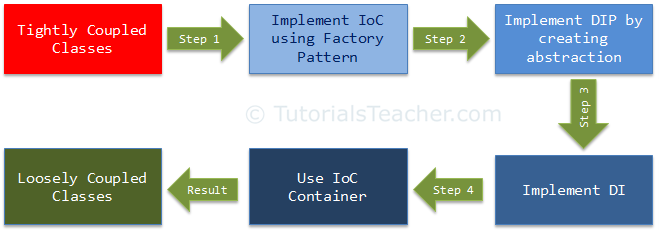
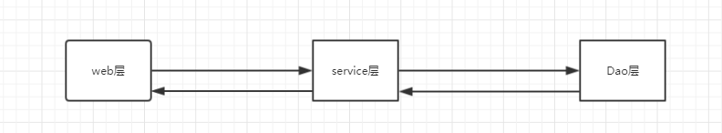

# 前言

本为主要为笔者在接触Spring的时候对IoC，DI等概念的学习笔记，参考了

<https://www.tutorialsteacher.com/ioc>，并加入了自己的理解

首先列出本文讨论的名词：

- IoC(Inversion of Control )：控制反转
- DIP(Dependency Inversion Principle )：依赖反转原则
- DI(Dependency Injection) ：依赖注入
- IoC container： IoC容器


# 从分类开始


> **从图中可以看到，总共分成三类**

- 设计原则 IoC , DIP
- 设计模式 DI
- 框架 Ioc Container

> 设计原则和设计模式的区别

- **设计原则：**

  为设计更好的应用程序提供了高层的指导，没有提供具体的解决方案

  eg:比如单一功能原则，只告诉我们 一个类应该仅有一个引起它变化的原因，但是没有告诉我们如何去实现

- **设计模式：**

  针对具体的问题提供了实现方案

  eg:单例模式


# 如何实现类之间的松耦合



我们不能仅通过使用IoC来实现松散耦合类。除了IoC，还需要使用DIP、DI和IoC容器。上图说明了将如何逐步实现松散耦合设计。

- step1:使用工厂模式实现IoC
- step2:通过创建接口实现DIP
- step3:实现依赖注入
- step4:使用IoC容器


# 控制反转（IoC）

> **IoC是一个设计原则，根据这个原则有很多的实现，其中依赖注入是其中一种**


> **先解释什么是控制**

一个类除了他主要的职责之外的其他职责。比如控制他所依赖的类的创建和绑定

eg:比如一个学生类Student，其里面有个学习的方法，学习是学生的主要职责，但是学习需要依赖笔，那么new Pen()这个就可以理解为对笔这个类的控制

```java
public class Pen(){
   	public void write(){
        // 具体实现
    }
}
public class Student{
    private Pen pen;
    public Student(){
 		pen = new Pen();// Student控制着Pen的创建和其生命周期       
    }
    void study(){
        //思考出答案，这个是主要职责
        pen.wirte(答案);
    }
}
```


> **再解释反转**

把控制交出去，把创建依赖对象这个操作交给别的类

eg:可以运用工厂模式来实现控制反转，从下面这个例子可以看到，Student不再自己new Pen而是调用Factory获取Pen，因此我们可以看到将控制（也就是创建Pen）交给了其它类（工厂类）

```java
public Student {
    private Pen pen;
    public Student(){
        pen = Factory.getPen();
    }
    public void study() {
        //思考出答案，这个是主要职责
        pen.wirte(答案);
    }
}
public class Pen(){
    public void write(){
        // 具体实现
    }
}
public class Factory{
    public static Pen getPen() {
        return new Pen();
    }
}
```


> **step 1使用工厂模式实现IoC**

首先，引入一个例子，接触过Java web开发的都应该清楚，我们通常对其分成web,service,dao三层



