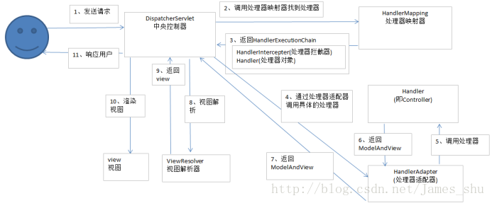
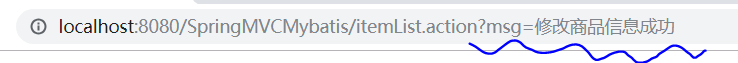
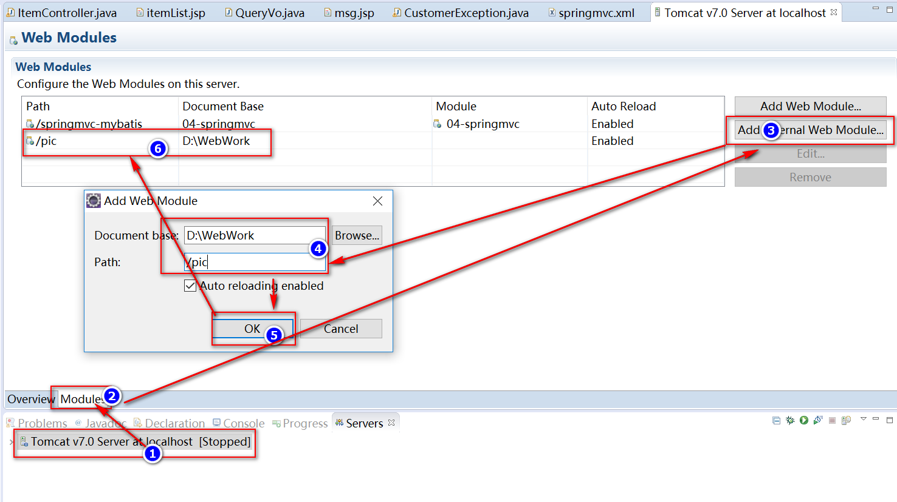

# 入门

1. 创建项目

2. 导入jar包

3. 编写控制类TestController

   ```java
   @Controller
   public class HelloController {
   	@RequestMapping("hello")
   	public ModelAndView hello(){
   		System.out.println("hello springmvc....");
   		//创建ModelAndView对象
   		ModelAndView mav = new ModelAndView();
   		//设置模型数据
   		mav.addObject("msg", "hello springmvc...");
   		//设置视图名字
   		mav.setViewName("/WEB-INF/jsp/hello.jsp");
   		return mav;
   	}
   }
   ```

4. 创建hello.jsp页面

5. 创建配置SpringMVC核心配置文件springmvc.xml

   ```xml
   <?xml version="1.0" encoding="UTF-8"?>
   <beans xmlns="http://www.springframework.org/schema/beans"
   	xmlns:xsi="http://www.w3.org/2001/XMLSchema-instance" xmlns:p="http://www.springframework.org/schema/p"
   	xmlns:context="http://www.springframework.org/schema/context"
   	xmlns:mvc="http://www.springframework.org/schema/mvc"
   	xsi:schemaLocation="http://www.springframework.org/schema/beans http://www.springframework.org/schema/beans/spring-beans-4.0.xsd
           http://www.springframework.org/schema/mvc http://www.springframework.org/schema/mvc/spring-mvc-4.0.xsd
           http://www.springframework.org/schema/context http://www.springframework.org/schema/context/spring-context-4.0.xsd">
   	
   	<!-- 扫描步骤3中被注解@Controller修饰的类 -->
   	<context:component-scan base-package="com.example.springmvc.controller" />
   </beans>
   
   ```

6. 在web.xml中配置前端控制器

   ```xml
   <!-- 配置前端控制器 -->
     <servlet>
       <servlet-name>springmvc</servlet-name>
       <servlet-class>org.springframework.web.servlet.DispatcherServlet</servlet-class>
       <!-- 加载springmvc核心配置文件 -->
       <init-param>
         <param-name>contextConfigLocation</param-name>
         <param-value>classpath:springmvc.xml</param-value>
       </init-param>
     </servlet>
     <!-- 配置拦截路径 -->
     <servlet-mapping>
       <servlet-name>springmvc</servlet-name>
       <url-pattern>*.action</url-pattern>
     </servlet-mapping>
   
   ```

7. 测试


# SpringMVC核心类

## SpringMVC工作流程



其工作流程为: 
1、用户发送请求至前端控制器DispatcherServlet 
2、DispatcherServlet收到请求调用HandlerMapping处理器映射器。 
3、处理器映射器根据请求url找到具体的处理器，生成处理器对象及处理器拦截器(二者组成HandlerExecutionChain),并将其一并返回给DispatcherServlet。 
4、DispatcherServlet通过HandlerAdapter处理器适配器调用处理器 
5、执行处理器(Controller，也叫后端控制器)。 
6、Controller执行完成返回ModelAndView 
7、HandlerAdapter将controller执行结果ModelAndView返回给DispatcherServlet 
8、DispatcherServlet将ModelAndView传给ViewReslover视图解析器 
9、ViewReslover解析后返回具体View 
10、DispatcherServlet对View进行渲染视图（即将模型数据填充至视图中）。 
11、DispatcherServlet对用户进行响应

【参考】<https://blog.csdn.net/James_shu/article/details/54616120>


## SpringMVC中的重要组件

### 一、中央控制器(DispatcherServlet)

- 中央控制器
- 作用：拦截请求
- 在web.xml中配置

```xml
<!-- 配置前端控制器 -->
<servlet>
    <servlet-name>springmvc</servlet-name>
    <servlet-class>org.springframework.web.servlet.DispatcherServlet</servlet-class>
    <init-param>
        <!-- 配置springmvc核心配置文件位置 -->
        <!-- 看源码发现public class DispatcherServlet extends FrameworkServlet
        然后FrameworkServlet 中拥有属性 private String contextConfigLocation; -->
        <param-name>contextConfigLocation</param-name>
        <param-value>classpath:springmvc.xml</param-value>
    </init-param>
</servlet>
  
<servlet-mapping>
    <servlet-name>springmvc</servlet-name>
    <url-pattern>*.action</url-pattern>
</servlet-mapping>
```


### 二、处理器映射器(HandlerMapping )和处理器适配器(HandlerAdapter) 

**接口HandlerMapping** 

- 处理器映射器
- 绑定url请求由哪个方法来处理，也就是说根据url可以找到处理这个请求的方法

**接口HandlerAdapter** 

- 处理器适配器
- 负责调用url请求所对应的方法

```xml
<!-- 处理器映射器 -->
<bean class="org.springframework.web.servlet.mvc.method.annotation.RequestMappingHandlerMapping"/>
<!-- 处理器适配器 -->
<bean class="org.springframework.web.servlet.mvc.method.annotation.RequestMappingHandlerAdapter"/>
```

或者

```xml
<!-- 配置注解驱动，相当于同时使用最新处理器映射器和处理器适配器，对json数据响应提供支持 -->
<mvc:annotation-driven/>
```


### 三、视图解析器(ViewResolver)

**接口ViewResolver**

- 视图解析器
  - prefix配置路径前缀
  - suffix配置路径后缀

```xml
<!-- 视图解析器 -->
<bean class="org.springframework.web.servlet.view.InternalResourceViewResolver">
	<property name="prefix" value="/WEB-INF/jsp/"/>
	<property name="suffix" value=".jsp"/>
</bean>
```


# 获取前端传来的参数

## 传统方式

默认参数，可以当作方法参数，传递到被@RequestMapping修饰的方法中 

- HttpServletRequest

- HttpServletResponse

- HttpSession

```java
/* 
    * 
    * 使用HttpServletRequest传递参数
    * 使用HttpServletResponse响应请求
    * */
@RequestMapping("test")
public void itemEdit(HttpServletRequest request, HttpServletResponse response, HttpSession session) throws IOException {
    String name = request.getParameter("name");
    response.setContentType("text/html;charset=UTF-8");
    response.setCharacterEncoding("utf-8");
    response.getWriter().print("前端传过来的参数name="+name);
}
```


## SpringMVC提供的支持

### 1、简单参数的传递：

eg:比如请求中有参数  http://localhost:8080/demoe?id=1

（1）在方法中设置Integer id

（2）如果参数名不同，需要使用@RequestParam注解

```java
public String itemEdit(Model model, @RequestParam(name="id",required=true,defaultValue="1")Integer num) {
}
```


### 2、使用实体类来封装请求传过来的参数

其中前端传过来的数据的name要和实体类的属性名一致

```java
public class Item {
    private Integer id;
    private String name;
    private Double price;
    private String detail;
    private String pic;
    private Date createtime;
	// getter()
	// setter()
}
```

```java
public String updateItem(Model model, Item item) {
}
```


### 3、普通数据类型数组参数

注意 参数名（如例子中的 names） 需要与前端一致

```java
@RequestMapping("getArray")
public void getArray(String[] names, HttpServletResponse response) throws IOException{
	response.setContentType("text/html;charset=UTF-8");
    response.setCharacterEncoding("UTF-8");
    PrintWriter writer = response.getWriter();
    for(int i=0;i<names.length;++i) {
        writer.println("第" + i + "个参数 = " + names[i]);
    }
    writer.flush();
}
```


### 4、List参数

如果前端


### 5、日期参数

（1）创建转换器，需要实现Converter

```java
import java.text.ParseException;
import java.text.SimpleDateFormat;
import java.util.Date;

import org.springframework.core.convert.converter.Converter;

public class DateConvert implements Converter<String, Date> {

    public Date convert(String str) {
        SimpleDateFormat simpleDateFormat = new SimpleDateFormat("yyyy-MM-dd HH:mm:ss");
        Date date = null;
        try {
            date = simpleDateFormat.parse(str);
        } catch (ParseException e) {
            // TODO Auto-generated catch block
            e.printStackTrace();
        }
        return date;
    }

}
```

（2）配置Converter

```xml
<!-- 配置注解驱动，相当于同时使用最新处理器映射器和处理器适配器，对json数据x响应提供支持 -->
<mvc:annotation-driven conversion-service="myConversion"/> <!-- 注意 需要在此处配置conversion-service-->
    
<!-- 配置自定义转化器 -->
<bean id="myConversion" class="org.springframework.format.support.FormattingConversionServiceFactoryBean">
    <property name="converters">
        <set>
            <!-- 自定义转化器 -->
            <bean class="utils.DateConvert"/>	
        </set>
    </property>
</bean>
```


# 响应请求

## 1、直接返回ModelAndView

- 设置 数据,即addObject()方法

- 设置 视图的路径，即setViewName()方法

```java
/**
     * 显示所有商品
     * @return
     */
    @RequestMapping(value= {"itemList","itemList2"},method= {RequestMethod.POST, RequestMethod.GET})
    public ModelAndView itemList() {
        List<Item> itemList = itemService.getItemList();
        ModelAndView modelAndView = new ModelAndView();
        modelAndView.addObject("itemList", itemList);
        modelAndView.setViewName("/WEB-INF/itemList.jsp");
        return modelAndView;
    }
```


## 2、直接返回String

改造上述方法，该方式就是简化了直接返回ModelAndView

- 将返回值改为String
- 不需要使用ModelAndView.setViewName()方法，直接return视图的路径

```java
/**
     * 显示所有商品
     * @return
     */
    @RequestMapping(value= {"itemList","itemList2"},method= {RequestMethod.POST, RequestMethod.GET})
    public String itemList() {
        List<Item> itemList = itemService.getItemList();
        ModelAndView modelAndView = new ModelAndView();
        modelAndView.addObject("itemList", itemList);
        return "/WEB-INF/itemList.jsp";
    }
```


##3、请求转发

return "forward:要转发的路径"

```java
@RequestMapping("updateItem")
public String updateItem(Model model, Item item) {
	//model.addAttribute();
	return "forward:itemList.action";
}
```


## 4、请求重定向

return "redirect:重定向的路径"

*注意：redirect会将request作用域的数据清除，但是会将参数加在url后面*




# SpringMVC中常用注解

## 1、@Controller

在SpringMVC 中，控制器Controller 负责处理由DispatcherServlet 分发的请求，它把用户请求的数据经过业务处理层处理之后封装成一个Model ，然后再把该Model 返回给对应的View 进行展示。

在SpringMVC 中提供了一个非常简便的定义Controller 的方法，你无需继承特定的类或实现特定的接口，只需使用@Controller 标记一个类是Controller ，然后使用@RequestMapping 和@RequestParam 等一些注解用以定义URL 请求和Controller 方法之间的映射，这样的Controller 就能被外界访问到。

此外Controller 不会直接依赖于HttpServletRequest 和HttpServletResponse 等HttpServlet 对象，它们可以通过Controller 的方法参数灵活的获取到。

@Controller 用于标记在一个类上，使用它标记的类就是一个SpringMVC Controller 对象。分发处理器将会扫描使用了该注解的类的方法，并检测该方法是否使用了@RequestMapping 注解。

@Controller 只是定义了一个控制器类，而使用@RequestMapping 注解的方法才是真正处理请求的处理器。单单使用@Controller 标记在一个类上还不能真正意义上的说它就是SpringMVC 的一个控制器类，因为这个时候Spring 还不认识它。那么要如何做Spring 才能认识它呢？这个时候就需要我们把这个控制器类交给Spring 来管理。有两种方式：

　　（1）在SpringMVC 的配置文件中定义MyController 的bean 对象。

　　（2）在SpringMVC 的配置文件中告诉Spring 该到哪里去找标记为@Controller 的Controller 控制器。

```xml
<!--方式一-->
<bean class="类的全路径"/>
<!--方式二-->
< context:component-scan base-package = "类所在包名" />
```


## 2、@RequestMapping

- 在类上

  ```java
  @Controller
  @RequestMapping("example")
  public class Controller{
      @RequstMapping("save") // 访问该方法的路径为 example/save
      public String save(){
      }   
  }
  ```

- **value**属性

  指定多个匹配路径

  ```java
  @RequestMapping(value= {"save","save1"})
  ```

- **method**属性

  限制提交方式，*不指定时，默认接收全部提交方式*

  ```java
  @RequestMapping(method={RequestMethod.GET, RequestMethod.POST})
  ```

- **consumes**

  指定处理请求的提交内容类型（Content-Type），例如application/json, text/html;

- **produces**

  指定返回的内容类型，仅当request请求头中的(Accept)类型中包含该指定类型才返回；

- **params**

  指定request中必须包含某些参数值是，才让该方法处理。

- **headers**

  指定request中必须包含某些指定的header值，才能让该方法处理请求。

## 3、@PathVariable

用于将请求URL中的模板变量映射到功能处理方法的参数上，即取出uri模板中的变量作为参数。如：

```java
@Controller  
public class TestController {  
     @RequestMapping(value="/user/{userId}/roles/{roleId}",method = RequestMethod.GET)  
     public String getLogin(@PathVariable("userId") String userId,  
         @PathVariable("roleId") String roleId){  
         System.out.println("User Id : " + userId);  
         System.out.println("Role Id : " + roleId);  
         return "hello";  
     }  
     @RequestMapping(value="/product/{productId}",method = RequestMethod.GET)  
     public String getProduct(@PathVariable("productId") String productId){  
           System.out.println("Product Id : " + productId);  
           return "hello";  
     }  
     @RequestMapping(value="/javabeat/{regexp1:[a-z-]+}",  
           method = RequestMethod.GET)  
     public String getRegExp(@PathVariable("regexp1") String regexp1){  
           System.out.println("URI Part 1 : " + regexp1);  
           return "hello";  
     }  
}
```

详细可以参考<https://blog.csdn.net/qian_ch/article/details/73826663>


# SpringMVC异常处理

1. 自定义异常处理器，实现接口

   ```java
   public class MyExceptionResolver implements HandlerExceptionResolver {
       public ModelAndView resolveException(HttpServletRequest request, HttpServletResponse response, Object handler,
               Exception ex) {
           ModelAndView modelAndView = new ModelAndView();
           modelAndView.addObject("msg", "系统发生故障，请联系管理员");
           modelAndView.setViewName("msg"); //对应 msg.jsp页面
           return modelAndView;
       }
   }
   ```

2. 在配置文件中配置异常处理器

   ```xml
   <!-- 配置异常处理类 -->
   <bean class="MyExceptionResolver"/> <!--自定义类的全路径-->
   ```


# 文件上传

1. **配置tomcat虚拟目录，也就是设置图片库的路径**

   - 方式一

     

   - 方式二：在tomcat配置文件server的Host标签中添加context标签

     ```xml
     <Context docBase="D:\pictures" path="/pic" reloadable="true" />
     ```

2. **导入上传功能需要的jar包**

   - commons-fileupload-1.2.2.jar
   - commons-io-2.0.1.jar

3. **配置多媒体解析器**

   ```xml
   <!-- 配置多媒体解析器 -->
   <bean id="multipartResolver" class="org.springframework.web.multipart.commons.CommonsMultipartResolver" >
       <property name="defaultEncoding" value="utf-8"/>
       <!--限制上传大小为100KB-->
       <property name="maxUploadSize" value="102400"/> 
   </bean>
   ```

   *注意id不能改，必须为*multipartResolver

4. **前端页面关于文件上传相关配置**

   *注意：*

   *(1)method="POST"*

   *(2)enctype="multipart/form-data"*

   ```xml
   <form action="" method="POST" enctype="multipart/form-data">
       <label for="file">文件</label>
       <input type="file" name="uploadfile" />
       <p><button type="submit">上传</button></p>        
   </form>
   ```

5. **编写文件上传处理代码**

   *注意：方法需要声明参数MultipartFile uploadfile表示文件，其中uploadfile要与前端的name值相对应*

   ```java
   @RequestMapping(value = "uploadFile")
   public String uploadFile(Model model, MultipartFile uploadfile) throws Exception {
       // 文件新名字，这里使用随机数
       String name = UUID.randomUUID().toString();
       // 文件原名字
       String oldName = uploadfile.getOriginalFilename();
       // 后缀名
       String exeName = oldName.substring(oldName.lastIndexOf("."));
   
       File pic = new File("H:\\pic\\" + name + exeName);
       // 保存文件到本地磁盘
       uploadfile.transferTo(pic); 
   
       model.addAttribute("msg", "保存文件成功");
       return "uploadFile";
   }
   ```


# JSON 数据

- 导入jar包
  - jackson-annotations-2.4.0.ja
  - jackson-core-2.4.2.jar
  - jackson-databind-2.4.2.jar

- 发送json数据

  使用@ResponseBody

  ```java
  @RequestMapping(value="getJson")
  @ResponseBody   // 使用该注解之后，直接返回实体类，不用手动生成json格式数据
  public Item getJson() {
      // 创建一个实体类
      Item item = new Item();
      item.setId(111);
      item.setName("手机");
      item.setPrice(1000d);
      return item; // 直接返回实体对象
  }
  ```

  结果：

  ```json
  {
  "id": 111,
  "name": "手机",
  "price": 1000,
  "detail": null,
  "pic": null,
  "createtime": null
  }
  ```

- 接收json数据

  使用@RequestBody

  ```java
  @RequestMapping(value="getFromClient")
  @ResponseBody
  public Item getFromClient(@RequestBody Item item) {
  	return item; // 直接返回前端发来的数据
  }
  ```

  测试：

  请求

  ```java
  POST /SpringMVCMybatis/getFromClient.action HTTP/1.1
  HOST: localhost:8080
  content-type: application/json
  cookie: JSESSIONID=97E417BE428C05EDE13D011D8D77CFC6
  content-length: 82
  
  {"id":111,"name":"手机","price":1000,"detail":null,"pic":null,"createtime":null}
  ```

  返回结果

  ```java
  {"id":111,"name":"手机","price":1000.0,"detail":null,"pic":null,"createtime":null}
  ```


# RESTful

```java
/**
* RESTful风格演示
*/
//RESTful风格url上的参数通过{}点位符绑定
//点位符参数名与方法参数名不一致时，通过@PathVariable绑定
@RequestMapping("/item/{id}")
public String testRest(@PathVariable("id") Integer ids, Model model) {
	Item item = itemServices.getItemById(ids);
	model.addAttribute("item", item);
	return "itemEdit";
}

```


# 拦截器

#### 1. 自定义拦截器，实现接口org.springframework.web.servlet.HandlerInterceptor 

```java
public class MyInterceptor implements HandlerInterceptor {
    //在Controller方法执行后被执行
    //处理异常、记录日志
    public void afterCompletion(HttpServletRequest request, HttpServletResponse response, Object arg2, Exception arg3)
            throws Exception {
        System.out.println("afterCompletion.....");
    }

    //在Controller方法执行后，返回ModelAndView之前被执行
    //设置或者清理页面共用参数等等
    public void postHandle(HttpServletRequest request, HttpServletResponse response, Object arg2, ModelAndView arg3)
            throws Exception {
        System.out.println("postHandle.......");
    }

    //在Controller方法执行前被执行
    //登录拦截、权限认证等等
    public boolean preHandle(HttpServletRequest request, HttpServletResponse response, Object arg2) throws Exception {
        
        return true; // 返回true不拦截，返回false拦截
    }
}
```

#### 2.配置文件中配置拦截器

```xml
<!-- 拦截器 -->
<mvc:interceptors>
	<mvc:interceptor>
		<!-- /**拦截所有请求，包括二级以上目录，/*拦截所有请求，不包括二级以上目录 -->
		<mvc:mapping path="/**"/>
		<!-- 不拦截的请求 -->
		<!-- <mvc:exclude-mapping path=""/> -->
		<!-- 自定义拦截器全路径 -->
		<bean class="interceptor.MyInterceptor"></bean>
	</mvc:interceptor>
</mvc:interceptors>
```


