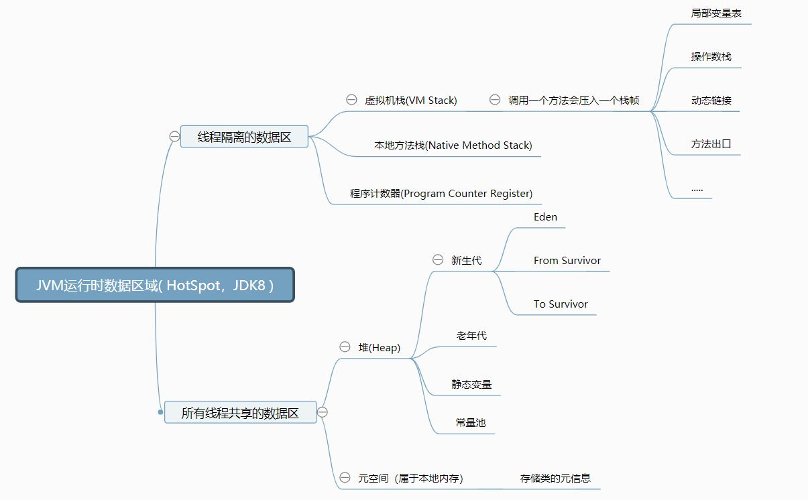
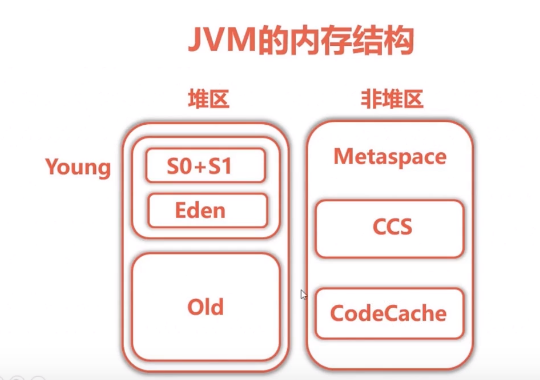

> 本文是笔者阅读《深入理解Java虚拟机》的读书笔记


# Java虚拟机规范

根据Java虚拟机规范，运行时数据区域可以划分为如下：

1. 由所有线程共享的数据区：

   - 方法区
   - 堆

2. 线程隔离的数据区：

   - 虚拟机栈

   - 本地方法栈
   - 程序计数器


规范是这样划分的，但具体的虚拟机实现不一样，不同版本的虚拟机也不一样

下面以JDK8的HotSpot虚拟机为例，进行划分


# HotSpot虚拟机内存划分



## 程序计数器

记录正在执行的虚拟机字节码指令的地址（如果正在执行的是本地方法则为空）。


## Java 虚拟机栈

是什么？

- Java方法执行的内存模型

- 每个 Java 方法在执行的同时会创建一个栈帧用于存储局部变量表、操作数栈、常量池引用等信息。

- 从方法调用直至执行完成的过程，就对应着一个栈帧在 Java 虚拟机栈中入栈和出栈的过程。

如何设置大小？

```shell
# 设置一个线程的栈大小
java -Xss128K Class文件
```

该区域可能抛出以下异常：

- 当线程请求的栈深度超过最大值，会抛出 StackOverflowError 异常；
- 栈进行动态扩展时如果无法申请到足够内存，会抛出 OutOfMemoryError 异常。


## 堆

所有对象都在这里分配内存，是垃圾收集的主要区域（"GC 堆"）。

```shell
# 可以通过 -Xms 和 -Xmx 这两个虚拟机参数来指定一个程序的堆内存大小，第一个参数设置初始值，第二个参数设置最大值。
java -Xms1M -Xmx2M HackTheJava
```


注意：

- 永久代是HotSpot对方法区的实现

  - 永久代物理是是堆的一部分，和新生代，老年代地址是连续的

- HotSpot在1.8之后取消了永久代，改为元空间

  - 元空间使用本地内存
- 元空间存储类的元信息
  - 静态变量和常量池等并入堆中
- 相当于永久代的数据被分到了堆和元空间中。


## 非堆区Metaspace

jdk8的jvm内存结构

- CCS(CompressedClassSpaceSize) : 压缩类空间，启动短指针时存在
- CodeCache : JIT编译后的本地代码




# HotSpot虚拟机对象

## 对象内存布局


### 对象头

- **Mark Word**

  - 这部分数据长度在32位和64位的虚拟机（未开启压缩指针）中分别为32bit和64bit

  - 对象需要存储的运行时数据很多，考虑到虚拟机的空间效率，Mark Word被设计成一个非固定的数据结构以便在极小的空间内存储更多的信息

    也就是说，对象在不同的状态下，这个Mark Word各个字段代表的意思也会跟着改变

    eg:下面举个例子说明，具体应该结合jvm中锁的实现来理解

    ```java
    // (1)normal object正常对象 
    // hash:25bit    age:4bit     biased_lock:1bit lock:2bit
    // (2)biased object
    // JavaThread*:23bit   epoch:2bit    age:4bit   biased_lock:1bit   lock:2bit
    // 还有其他状态的对象
    ```

    *具体可以参考https://blog.csdn.net/zhoufanyang_china/article/details/54601311*

    *<https://www.cnblogs.com/duanxz/p/4967042.html>*

- **类型指针**

  指向对象所属类的元数据，（如果是使用句柄的方式定位对象，则不需要）

  *下文会具体展开通过句柄来定位对象在堆中的位置*

- 如果对象是一个**数组**，那么对象头还需要存储数组的大小


### 实例数据

各种类型字段的内容，也就是类的普通属性成员


### 对齐填充

由于HotSpot VM 的自动内存管理系统要求对象起始地址必须是8字节的整数倍，因此需要将对象大小补充为8的倍数


## 对象的访问定位

我们一般使用的是对象的引用，那么引用是如何定位堆中的对象的呢？

- 通过句柄访问对象

  

- 通过直接指针访问对象

  

对比

- 使用句柄，应用类型存储的是稳定的句柄地址，在垃圾回收时，对象被移动，不用更改引用类型的值
- 使用直接指针，速度更快，减少了一次指针定位的开销