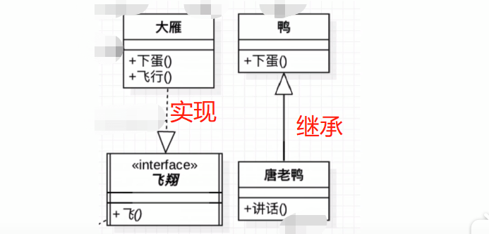
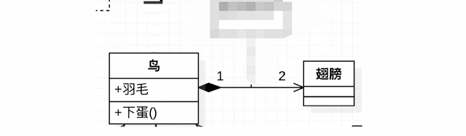
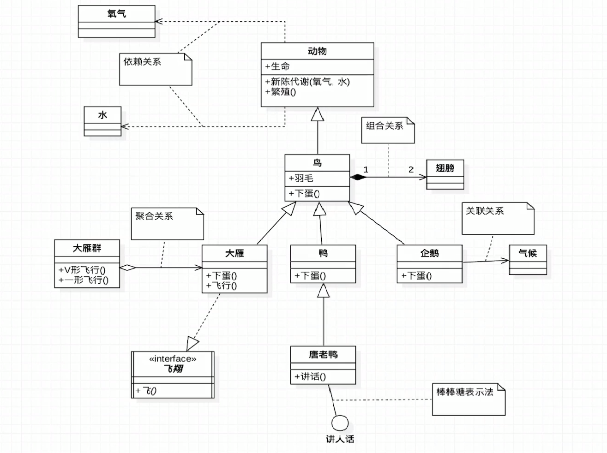
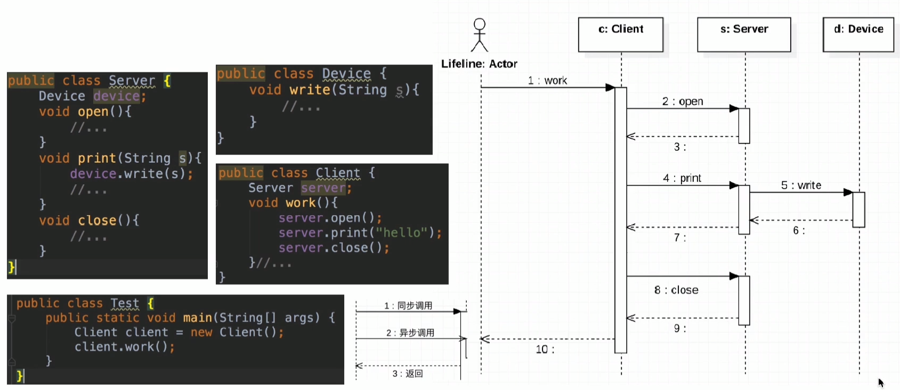

# 类图

## 继承与实现

- UML箭头方向：从子类指向父类
- 实线+空心三角箭头：继承
- 虚线+空心三角箭头：实现（接口比较虚）

  

## 关联与依赖

- 实线+加箭头：关联关系（通常一个类作为另一个类的属性）
- 虚线+箭头：依赖关系（临时用一下，比如方法参数，比较虚）

## 聚合和组合

空心菱形：聚合（大雁和大雁群），是has a的关系，弱关系（空心）

实心菱形：组合（鸟和翅膀），整体与局部的关系，contains-a的关系

## 总结

# 时序图

参考资料：

《大话设计模式》

<https://coding.imooc.com/class/270.html>