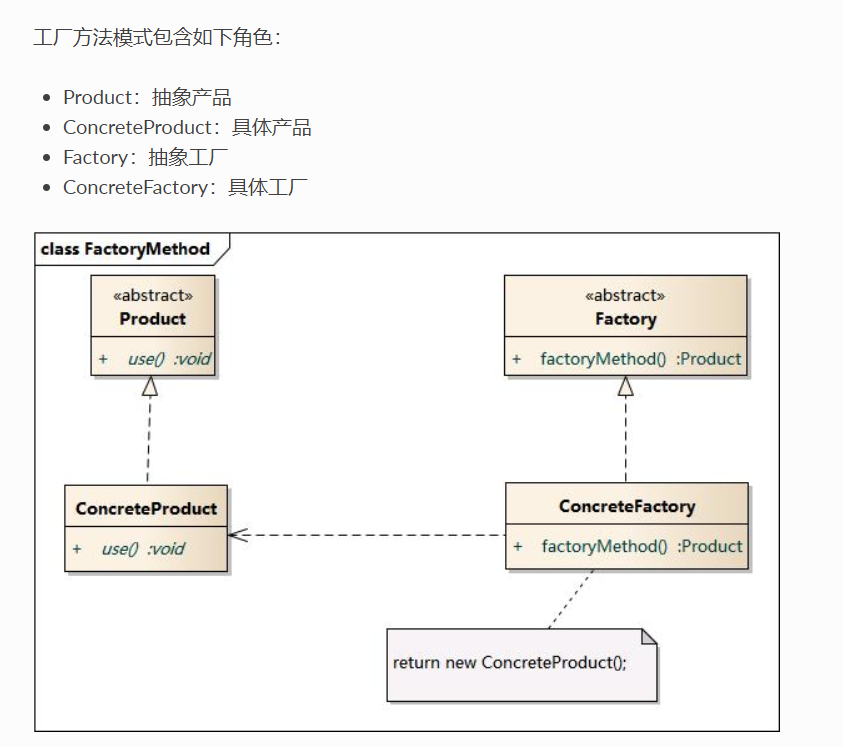
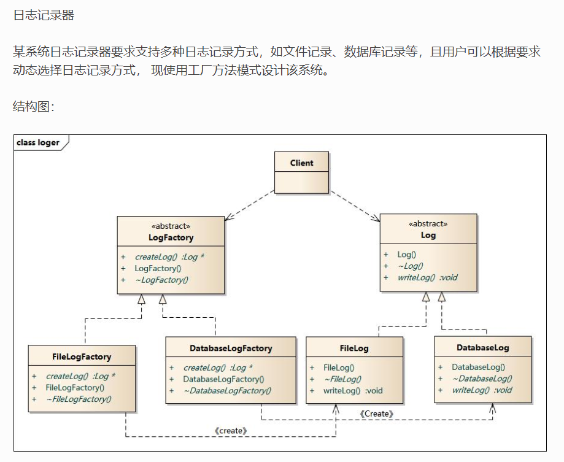

# 工厂方法

## 定义：

定义一个创建对象的接口，但是让实现这个接口的类来决定实例化哪个类

> 定义一个抽象工厂，具体怎么创建对象，由子类来实现
>
> 因此添加新的产品，只需要添加一个新的实体类，然后再创建一个抽象工厂的子类负责创建新的产品


## 优点：

系统中加入新产品时，无须修改抽象工厂和抽象产品提供的接口，无须修改客户端，也无须修改其他的具体工厂和具体产品，而只要添加一个具体工厂和具体产品就可以了。这样，系统的可扩展性也就变得非常好，完全符合“开闭原则”

## 缺点：

在添加新产品时，需要编写新的具体产品类，而且还要提供与之对应的具体工厂类，系统中类的个数将成对增加


## 类图




## 应用

JDK中的工厂方法

```java
// 抽象工厂
interface Collection{
	Iterator<E> iterator();	
}

其中
Iterator 为抽象产品
```


日志记录器

