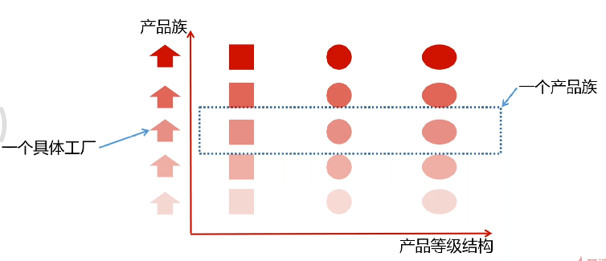

## 定义


优点：

- 应用代码不和具体的产品有依赖关系，只和具体的产品族工厂有依赖关系
- 方便扩展，增加一个产品族很方便

缺点：

- 新增产品等级比较麻烦，需要修改抽象工厂的实现


**产品等级和产品族**



eg: 

Java视频、Java笔记、Java源码 是一个产品族

Python视频、Python笔记、Python源码 是一个产品族

Java视频、Python视频是一个产品等级


## 类图


工厂方法跟抽象工厂的对比：

- 工厂方法关注产品等级
- 抽象工厂关注产品族


## 应用

jdbc中的java.sql.Connection接口

```java
public interface Connection{
	PreparedStatement prepareStatement(String sql);
    
    Statement createStatement();
}
```

可以看到，如果用的是mysql，就会返回mysql的产品族

用的是Oracle，就会返回Oracle的产品族

PreparedStatement和Statement 构成不同的产品等级


Mybatis中的SqlSessionFactory


