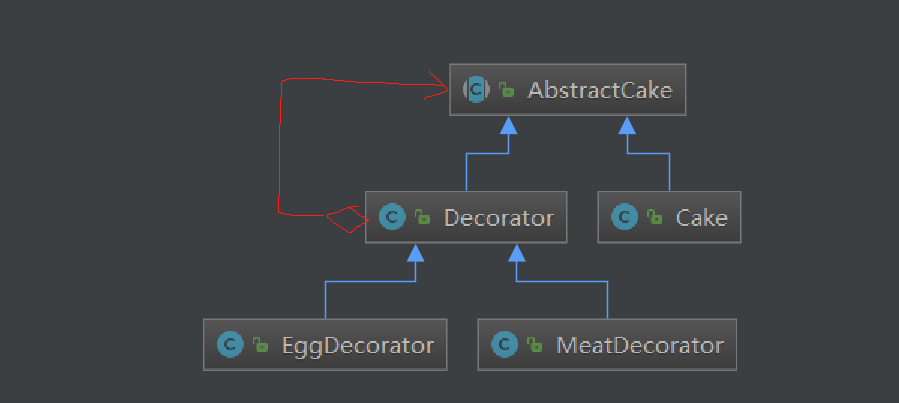
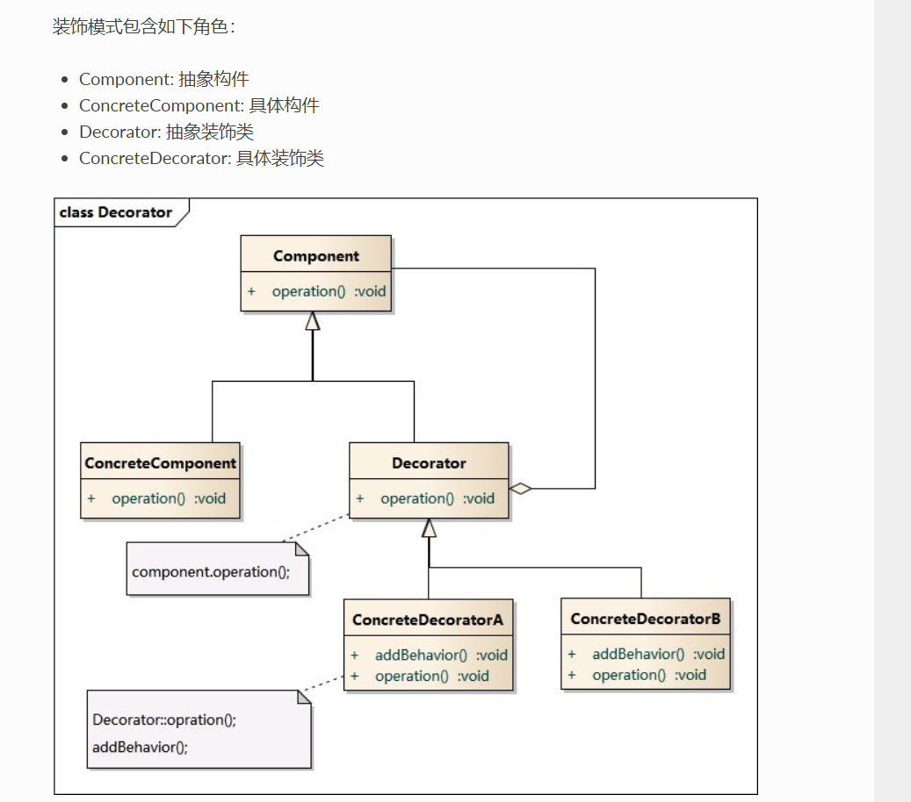
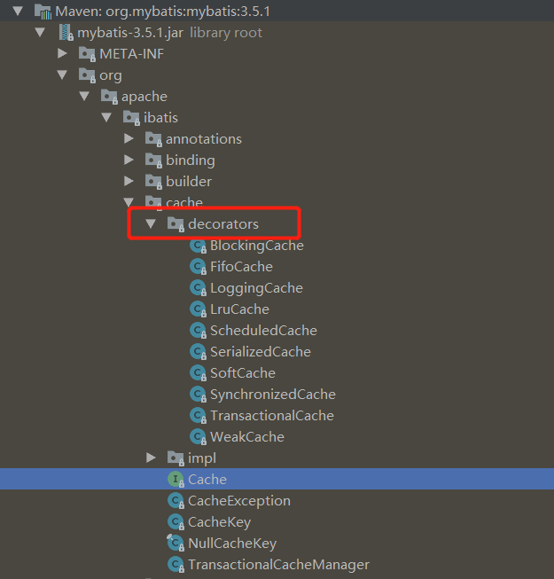

[TOC]


# 装饰者模式

## 定义：

在不改变原有对象的基础上，将功能附加到对象上


## 使用场景

- 扩展一个类的功能
- 动态给一个对象添加功能，动态撤销


优点：

比继承灵活

缺点：

（1）出现更多代码，更多的类

（2）多层装饰会使使用变复杂

## 比较

- 装饰者模式和代理模式：

  （1）常常在代理类中创建原对象的实例

  （2）装饰者模式是将原有对象作为参数传递给构造器

- 装饰者模式和适配器模式

  


## 例子

煎饼，可以加蛋， 加肉

```java
// 抽象实体类
public abstract class AbstractCake {
    abstract protected String description();
    abstract protected int cost();
}
```

```java
// 实体类
public class Cake extends AbstractCake {
    @Override
    public String description(){
        return "煎饼";
    }
    @Override
    public int cost(){
        return 8;
    }
}
```

```java
// 抽象装饰者
public class Decorator extends AbstractCake{
    private AbstractCake cake;
    // 将需要加强的类，作为参数传进来
    public Decorator(AbstractCake cake){
        this.cake = cake;
    }
    @Override
    public String description() {
        return cake.description();
    }
    @Override
    public int cost() {
        return cake.cost();
    }
}
```

```java
// 加蛋装饰者
public class EggDecorator extends Decorator {
    public EggDecorator(AbstractCake cake) {
        super(cake);
    }
    @Override
    public String description() {
        return super.description() + " 加一个鸡蛋";
    }
    @Override
    public int cost() {
        // 一个鸡蛋1块钱
        return super.cost() + 1;
    }
}
```

```java
// 加肉装饰者
public class MeatDecorator extends Decorator {
    public MeatDecorator(AbstractCake cake) {
        super(cake);
    }
    @Override
    public String description() {
        return super.description() + "加1份肉";
    }
    @Override
    public int cost() {
        // 一份肉两块钱
        return super.cost() + 2;
    }
}
```

```java
// 测试
public class Test {
    public static void main(String[] args) {
        AbstractCake cake = new Cake();
        System.out.println(cake.description() + " " + cake.cost() + "元");
        // 加鸡蛋
        cake = new EggDecorator(cake);
        System.out.println(cake.description() + " " + cake.cost() + "元");
        // 还要再加一份肉
        cake = new MeatDecorator(cake);
        System.out.println(cake.description() + " " + cake.cost() + "元");
    }
}
// 运行结果
煎饼 8元
煎饼 加一个鸡蛋 9元
煎饼 加一个鸡蛋加1份肉 11元
```




## 类图




## 源码中的应用

JDK

```java
BufferReader  
```


Spring

```java
public class TransactionalCache implements Cache {
    // 需要增强功能的类
    private final Cache delegate;
    // 构造函数
    public TransactionalCache(Cache delegate) {
        this.delegate = delegate;
        this.clearOnCommit = false;
        this.entriesToAddOnCommit = new HashMap<>();
        this.entriesMissedInCache = new HashSet<>();
    }
}
```


Mybatis中的org.apache.ibatis.cache.Cache

