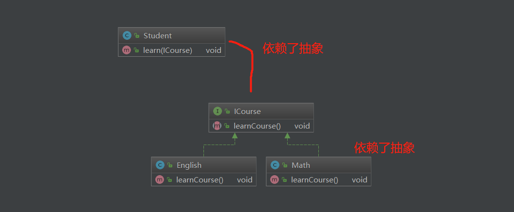

不要过分遵循，过分遵循开发成本高，需要讲究一个平衡

# 开闭原则

对扩展开放，对修改关闭

怎么实现？用抽象构建框架，用实现扩展细节

# 依赖倒置原则

定义：高层模块不应该依赖低层模块，二者都应该依赖其抽象

- 针对接口编程

例子：

这样的好处：比如学生又有新的课要学习了，只要实现新的课就行了，不用修改Student这个类（对修改关闭，对对扩展开放）

> 可以类比web开发中，service层和dao层的关系

# 单一职责原则

定义：不要存在多与一个导致类变更的原因

一个类/接口/方法只负责一项职责

优点：降低类的复杂度、提高类的可读性、提高系统的可维护性，降低变更引起的风险

# 接口隔离原则

定义：用多个专门的接口，而不使用单一的总接口，客户端不因该依赖它不需要的接口

- 尽量细化接口，接口中方法尽量少

# 迪米特原则（最少知道原则）

定义：一个对象应该对其他对象保持最少的了解

优点：降低类之间的耦合

> 强调之和朋友交流，不和陌生人说话
>
> 朋友：成员变量，方法输入参数，返回值中的类
>
> 陌生人：出现在方法体内部的类

里氏替换原则

合成复用原则